# JavaUtilMap
Here is all about Map of Java

<h1>1. AbstractMap[Abstract Class] </h1>
<ul>
<li> <h3> 1. Every class of Java is inherited  from <i> java.lang.Object </i>  </h3></li>
<li> <h3> 2. The <i> AbstractMap </i> class is the base class of the map classes in Java.</h3></li>


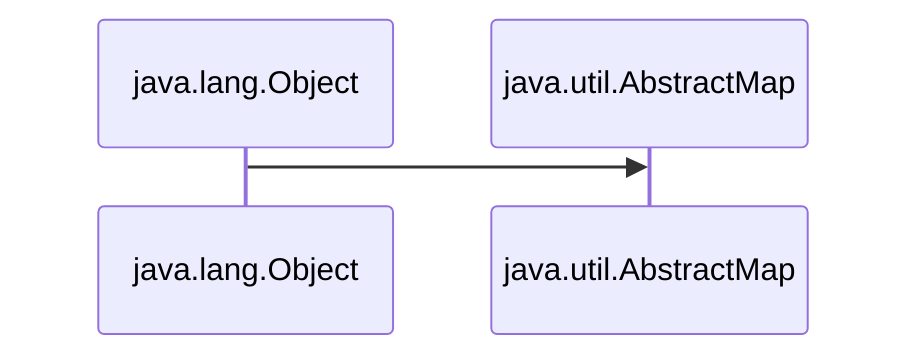

<li> <h3> 3. The <i>AbstractMap</i> class is a part of the Java Collection Framework.</h3></li>
<li> <h3> 4.  It directly implements the <i>Map</i> interface to provide a structure to it.</h3></li>
<li> <h3> 5.  <i>AbstractMap</i> is an abstract class, hence we cannot create <i>AbstractMap</i>'s Object but the concrete classes that inherit from <i>AbstractMap</i> can be used to create objects .</h3></li>

<br>

<table>
 <tr>
    <th>Interface</th>
    <th>Hash Table</th>
    <th>Resizable Array</th> 
   <th>Balanced Tree</th> 
   <th>Linked List</th> 
</tr> 
<tr>
  <td >Map</td>
  <td >HashMap</td> 
  <td ></td> 
  <td >TreeMap</td>
  <td ></td>
</tr>
<tr>
  <td >SortedMap</td>
  <td ></td> 
  <td ></td> 
  <td >TreeMap</td>
  <td ></td>
</tr>
<tr>
  <td >NavigableMap</td>
  <td ></td> 
  <td ></td> 
  <td >TreeMap</td>
  <td ></td>
</tr>
<tr>
  <td colspan="5">Map.Entry(Inner Class of Map)</td>
 
</tr>
</table>

<h3 align="center">

```Syntax

public abstract class AbstractMap<K,V> extends Object, implements Map<K,V>

```

</h3>

</ul>

<h1 align ="center">A. Map - Interface </h1>

<ul>
<li><h3>1. A <i> map</i> stores data in Key/Value pairs much like an array.</h3></li>
<li><h3>2. Every Key/Value pairs stored in indexes .</h3></li>
<li><h3>3. Every Key/Value pairs are stored as <i>Objects</i> in Java.</h3></li>
<li><h3>4. Typically , <i>keys</i> are Strings.</h3></li>
<li><h3>5. Given a Key and a Value, we can store the value in a <i>Map</i> object.</h3></li>
<li><h3>6. After the value is stored , we can retrieve it by using its Key.</h3></li>
<li><h3>7. Map is generic and is declared : </h3></li>

<h3 align="center">

```Syntax

interface Map<K,V>

```

</h3>


<h3> Where, <i>K</i> specifies the type of keys and <i>V</i> specifies the type of values. </h3>

<li><h3>8. Map do not implement the <i>Iterable</i> interface. Futhermore <i>Iterator</i> also cannot be obtained by a map.</h3></li>

<ul>

```Syntax

That is :

import java.util.Iterator;
import  java.lang.Iterable;

Iterable<Map<Key, Value>> itr = map; → Cannot be Obtained

Or

Iterator<Map<Key, Value>> iterator = map.iterator(); → Cannot be Obtained

```
</ul>

<table>
 <tr>
    <th>Interface</th>
    <th>Description</th>
    
   
</tr> 
<tr>
  <td >Map</td>
  <td >Maps unique keys to values.</td> 
</tr>
<tr>
  <td >Map.Entry</td>
  <td >Describes an element (a key/value) in a map. This is an inner class of Map.</td> 
  
</tr>
<tr>
  <td >NavigableMap</td>
  <td >It extends SortedMap to handle the retrieval of entries based on closest-match searches.</td> 
</tr>
<tr>
  <td >SortedMap</td>
  <td >It extends Map to keep the keys in ascending order.</td> 
</tr>
</table>
</ul>


<h1> 3. HashMap </h1>

<ul>

<h3>1. HashMap extends Abstract Map abstract class. </h3>
<h3>2. As Abstract Map implements Map interface and extends java.lang.Object class , HashMap inherits all of their functions. </h3>
<li> <h3> 3. And most imported thing : "The HashMap provides us an unsorted, unordered Map ".</h3></li>
<li> <h3> 4. HashMap has implementation based on a Hash table.</h3></li>
<li> <h3> 5. Duplicate keys are not allowed i.e. Keys are unique .</h3></li>
<li> <h3> 6. Whereas, Duplicate values can be present / allowed .</h3></li>


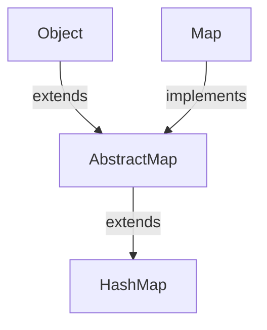
<h2> </h2>

<h2 align="Center">Constructors of HashMap </h2>

<ul>

<h3> <a href="https://github.com/AvinandanBose/JavaUtilMap/blob/main/map1.java"> 1.HashMap() </h3>

<h3> <a href="https://github.com/AvinandanBose/JavaUtilMap/blob/main/map2.java"> 2.HashMap(int initialCapacity) </h3>

<h3> <a href="https://github.com/AvinandanBose/JavaUtilMap/blob/main/map3.java"> 3.HashMap(int initialCapacity, float loadFactor) </h3>

<h3> <a href="https://github.com/AvinandanBose/JavaUtilMap/blob/main/map3.java"> 4.HashMap(Map<? extends K, ? extends V> m) </h3>

<table>
 <tr>
    <th>Constructor</th>
    <th>Does This</th>
    
   
</tr> 
<tr>
  <td >HashMap()</td>
  <td >It constructs a new empty map.</td> 
</tr>
<tr>
  <td >HashMap(int initialCapacity)</td>
  <td >It constructs a new empty map, with the given initial capacity.</td> 
  
</tr>
<tr>
  <td >HashMap(int initialCapacity, float loadFactor)</td>
  <td >It constructs a new empty map, with the given initial capacity and  the given load factor.</td> 
</tr>
<tr>
  <td >HashMap(Map<? extends K, ? extends V> m)</td>
  <td >It constructs a new  map, with the same mappings as the given map.</td> 
</tr>
</table>

</ul>

```Syntax

:ThresHold of HashMap, Capacity and LoadFactor:
--------------------------------------------------

ThresHold of HashMap : 
The threshold of a HashMap is approximately the product of current capacity and load factor

LoadFactor : 
The load factor is the measure that decides when to increase the capacity of the Map.

Capacity of HashMap: 
Capacity is the number of buckets in the HashMap. 

Default Capacity of HashMap: 16
That is empty HashMap created with capacity 16.

Default LoadFactor of HashMap: 0.75
That is empty HashMap created with Load Factor 0.75.

Default Threshold of HashMap: is 16 * 0.75 = 12.
That is empty HashMap created with threshold 12.

```


<h3> <i> Extras: </i> </h3>

```Syntax

Index: 
It is the integer value .
It is obtained after performing → 
Bitwise AND operation on the Value of Hash of the Key and Array Size Minus One.

i.e., :| Index = hashcode(key) & (ArraySize – 1) |:


Bucket: It is a LinkedList structure of nodes.


Node: It is the elementary unit of a HashMap. 
It contains the key-value pair and a link to the next node.

Next: Link to the next node.

It is represented as:  Node<K,V> next.

Where K represents Key and V represents Value.

Rehashing: It is the process of doubling the capacity of the HashMap ,
after it reaches its Threshold. In java, HashMap continues to 
rehash(by default) in the following sequence – 2^4, 2^5, 2^6, 2^7, …. so on. 


```


<h2> </h2>

<h2 align="Center">Methods of HashMap </h2>

<ul>
<h3> <a href="https://github.com/AvinandanBose/JavaUtilMap/blob/main/mapmethods1.java"> 1.Clear </h3>

```Syntax

It removes all the mappings of this map.
The map will be empty after this call returns.

```

<h3> <a href="https://github.com/AvinandanBose/JavaUtilMap/blob/main/mapmethods2.java"> 2.Clone </h3>

```Syntax
Returns a shallow copy of the HashMap instance provided for cloning
but the keys and values themselves are not cloned.

```


<h3> <a href="https://github.com/AvinandanBose/JavaUtilMap/blob/main/mapmethods3.java"> 3.containsKey </h3>

```Syntax
Returns true if this map contains a mapping for the specified key.

```

<h3> <a href="https://github.com/AvinandanBose/JavaUtilMap/blob/main/mapmethods4.java"> 4.containsValue </h3>

```Syntax
Returns true if this map maps one or more keys to the specified value.

```

<h3> <a href="https://github.com/AvinandanBose/JavaUtilMap/blob/main/mapmethods5.java"> 5.forEach </h3>

```Syntax
Performs the given action for each entry in this map 
until all entries have been processed or the action throws an exception.

```


<h3> <a href="https://github.com/AvinandanBose/JavaUtilMap/blob/main/mapmethods6.java"> 6.get </h3>
  
```Syntax

Syntax: get(key: Key)

Returns the value to which the specified key is mapped, 
or null if this map contains no mapping for the key.

```

<h3> <a href="https://github.com/AvinandanBose/JavaUtilMap/blob/main/mapmethods7.java"> 7.getOrDefault</h3>

```Syntax

Syntax: getOrDefault(key: Key , defaultValue:Value)

Returns the value to which the specified key is mapped, 
or defaultValue if this map contains no mapping for the key.

i.e.,getOrDefault(key:"One" , defaultValue:1)
then it will return the value for the key : "One"
Or, it will return the value for the value : 1

Most priority given or first search is Key for Value .
If not found , then it searches for defaultValue for value.

That is if "One" is not found then it searches for 1.
```

<h3> <a href="https://github.com/AvinandanBose/JavaUtilMap/blob/main/mapmethods8.java"> 8.isEmpty</h3>

```Syntax

Returns true if this map contains no key-value mappings.
```

<h3> <a href="https://github.com/AvinandanBose/JavaUtilMap/blob/main/mapmethods9.java"> 9.KeySet</h3>

```Syntax

Returns a Set view of the keys contained in this map. 
The set is backed by the map, 
so changes to the map are reflected in the set, and vice-versa.

Note:
As Set<K> keySet()→ Is a Function that returns Set,
Hence, it call all those functions that Set contains,
Such as:
→forEach
→toArray()
→remove()
→removeIf()
→retainAll()
→removeAll()
→Stream()
→ParallelStream()
→spliterator()
→iterator()
→contains()
→containsAll()
...etc.

It does not support the add or addAll operations.
```


<h3> <a href="https://github.com/AvinandanBose/JavaUtilMap/blob/main/mapmethods10.java"> 10.Put</h3>

```Syntax

Associates the specified value with the specified key in this map. 
If the map previously contained a mapping for the key, 
the old value is replaced.
```

<h3> <a href="https://github.com/AvinandanBose/JavaUtilMap/blob/main/mapmethods11.java"> 11.PutAll</h3>

```Syntax

Copies all of the mappings from the specified map to this map. 
These mappings will replace any mappings that this map had ,
for any of the keys currently in the specified map.
```

<h3> <a href="https://github.com/AvinandanBose/JavaUtilMap/blob/main/mapmethods12.java"> 12.Remove(key: Key)</h3>

```Syntax
Removes the mapping for the specified key from this map if present.
```

<h3> <a href="https://github.com/AvinandanBose/JavaUtilMap/blob/main/mapmethods13.java"> 13.Remove(key: Key, value:Value)</h3>

```Syntax
Removes the entry for the specified key only if it is currently mapped to the specified value.
```

<h3> <a href="https://github.com/AvinandanBose/JavaUtilMap/blob/main/mapmethods14.java"> 14.Replace(key: Key, oldValue:Value, newValue:Value)</h3>

```Syntax
Replaces the entry for the specified key only if currently mapped to the specified value.
It replaces old value with new value.
```

<h3> <a href="https://github.com/AvinandanBose/JavaUtilMap/blob/main/mapmethods15.java"> 15.ReplaceAll(BiFunction function)</h3>

```Syntax
Replaces each entry's value with the result of invoking the given function,
on that entry until all entries have been processed or 
the function throws an exception.
```

<h3> <a href="https://github.com/AvinandanBose/JavaUtilMap/blob/main/mapmethods16.java"> 16.Size()</h3>

```Syntax
Returns the number of key-value mappings in this map.
```

<h3> <a href="https://github.com/AvinandanBose/JavaUtilMap/blob/main/mapmethods17.java"> 17.values()</h3>

```Syntax
Returns a Collection view of the values contained in this map.

Note:
Iterator.remove
Iterator.hasNext()
Iterator.next()
Collection.remove, 
Collection.removeAll, 
Collection.removeIf,
Collection.retainAll and 
Collection.clear 

like selected operations is performed,
as it returns a Collection.

Except:

It does not support the add or addAll operations.
```

<h3> <a href="https://github.com/AvinandanBose/JavaUtilMap/blob/main/mapmethods18.java"> 18.putIfAbsent()</h3>

```Syntax
If the specified key is not already associated with a value ,
then associates it with the given value .

If the specified key is not already associated with a value,
and now the new value mapped with the new key is NULL , 
then it will return null. 
```
<h3> <a href="https://github.com/AvinandanBose/JavaUtilMap/blob/main/mapmethods19.java"> 19.compute(key:Key,BiFunction function)</h3>


```Syntax
Attempts to compute a mapping for the specified key and 
its current mapped value (or null if there is no current mapping).
```

<h3> <a href="https://github.com/AvinandanBose/JavaUtilMap/blob/main/mapmethods20.java"> 20.computeIfAbsent(key:Key, MappingFunction function)</h3>


```Syntax
If the specified key is not already associated with a value 
(or is mapped to null), attempts to compute its value,
using the given mapping function and
enters it into this map unless null.

If the mapping function returns null, no mapping is recorded.
```

<h3> <a href="https://github.com/AvinandanBose/JavaUtilMap/blob/main/mapmethods21.java"> 21.computeIfPresent(key:Key, BiFunction function)</h3>


```Syntax
If the value for the specified key is present and non-null, 
attempts to compute a new mapping given the key 
and its current mapped value.

If the remapping function returns null, the mapping is removed.
```


<h3> <a href="https://github.com/AvinandanBose/JavaUtilMap/blob/main/mapmethods22.java"> 22.entrySet()</h3>


```Syntax
Returns a Set view of the mappings contained in this map. 
The set is backed by the map, 
so changes to the map are reflected in the set, 
and vice-versa. 


As entrySet()→ Is a Function that returns Set,
Hence, it call all those functions that Set contains,
Such as:
→forEach
→toArray()
→remove()
→removeIf()
→retainAll()
→removeAll()
→Stream()
→ParallelStream()
→spliterator()
→iterator()
→contains()
→containsAll()
...etc.

It does not support the add or addAll operations.
```

<h3> <a href="https://github.com/AvinandanBose/JavaUtilMap/blob/main/mapmethods23.java"> 22.merge(key:Key, value:Value, BiFunction remappingFunction)</h3>


```Syntax
If the specified key is not already associated with a value
or is associated with null, associates it with the given non-null value. 
Otherwise, replaces the associated value with the results of the given remapping function, 
or removes if the result is null. 

This method may be of use when combining multiple mapped values for a key.
```

<h3> <a href="https://github.com/AvinandanBose/JavaUtilMap/blob/main/mapmethods24.java"> 24.Replace(key: Key, value:Value)</h3>

```Syntax
Replaces the entry for the specified key only if it is currently mapped to some value.
```

<table>
 <tr>
    <th>Methods</th>
    <th>Does This</th>
    
   
</tr> 
<tr>
  <td >1. Clear</td>
  <td >It removes all of the mappings from the map.</td> 
</tr>
<tr>
  <td >2.Clone</td>
  <td >It gets a copy of this HashMap instance</td> 
  
</tr>
<tr>
  <td >3.containsKey</td>
  <td >Returns true if this map contains a mapping for the specified key.</td> 
</tr>
<tr>
  <td >4.containsValue</td>
  <td >Returns true if this map maps one or more keys to the specified value.</td> 
</tr>

<tr>
  <td >5.forEach</td>
  <td >Performs the given action for each entry in this map 
until all entries have been processed or the action throws an exception.</td> 
</tr>

<tr>
  <td >6.get(key: Key)</td>
  <td >Returns the value to which the specified key is mapped, 
or null if this map contains no mapping for the key.</td> 
</tr>


<tr>
  <td >7.getOrDefault(key: Key , defaultValue:Value)</td>
  <td >Returns the value to which the specified key is mapped, 
or defaultValue if this map contains no mapping for the key.</td> 
</tr>


<tr>
  <td >8.isEmpty</td>
  <td >Returns true if this map contains no key-value mappings.</td> 
</tr>

<tr>
  <td >9.KeySet</td>
  <td >Returns a Set view of the keys contained in this map. 
The set is backed by the map, 
so changes to the map are reflected in the set, and vice-versa.If the map is modified while an iteration over the set is in progress (except through the iterator's own remove operation), the results of the iteration are undefined. The set supports element removal, which removes the corresponding mapping from the map, via the Iterator.remove, Set.remove, removeAll, retainAll, and clear operations.
It does not support the add or addAll operations.
</td> 
</tr>

<tr>
  <td >10.Put</td>
  <td >Associates the specified value with the specified key in this map. 
If the map previously contained a mapping for the key, 
the old value is replaced.</td> 
</tr>

<tr>
  <td >11.PutAll</td>
  <td > Copies all of the mappings from the specified map to this map. 
These mappings will replace any mappings that this map had ,
for any of the keys currently in the specified map.</td> 
</tr>

<tr>
  <td >12.Remove(key: Key)</td>
  <td > Removes the mapping for the specified key from this map if present.</td> 
</tr>

<tr>
  <td >13.Remove(key: Key, value:Value)</td>
  <td > Removes the entry for the specified key only if it is currently mapped to the specified value.
</td> 

<tr>
  <td >14.Replace(key: Key, oldValue:Value, newValue:Value)</td>
  <td > Replaces the entry for the specified key only if currently mapped to the specified value.
It replaces old value with new value.
</td>
</tr>

<tr>
  <td >15.ReplaceAll(BiFunction function)</td>
  <td > Replaces each entry's value with the result of invoking the given function,
on that entry until all entries have been processed or 
the function throws an exception.
</td>
</tr>

<tr>
  <td >16.Size()</td>
  <td > Returns the number of key-value mappings in this map.
</td>
</tr>

<tr>
  <td >17.values()</td>
  <td > Returns a Collection view of the values contained in this map.
</td>
</tr>

<tr>
  <td >18.putIfAbsent()</td>
  <td > If the specified key is not already associated with a value ,
then associates it with the given value .
</td>
</tr>

<tr>
  <td >19.compute(key:Key,BiFunction function)</td>
  <td > Attempts to compute a mapping for the specified key and 
its current mapped value (or null if there is no current mapping).
</td>
</tr>

<tr>
  <td >20.computeIfAbsent(key:Key, MappingFunction function)</td>
  <td > If the specified key is not already associated with a value 
(or is mapped to null), attempts to compute its value,
using the given mapping function and
enters it into this map unless null.

If the mapping function returns null, no mapping is recorded.
</td>
</tr>

<tr>
  <td >21.computeIfPresent(key:Key, BiFunction function)</td>
  <td >If the value for the specified key is present and non-null, 
attempts to compute a new mapping given the key 
and its current mapped value.

If the remapping function returns null, the mapping is removed.
</td>
</tr>

<tr>
  <td >22.entrySet()</td>
  <td >Returns a Set view of the mappings contained in this map. 
The set is backed by the map, 
so changes to the map are reflected in the set, 
and vice-versa. If the map is modified while an iteration over the set is in progress (except through the iterator's own remove operation, or through the setValue operation on a map entry returned by the iterator) the results of the iteration are undefined. The set supports element removal, which removes the corresponding mapping from the map, via the Iterator.remove, Set.remove, removeAll, retainAll and clear operations.It does not support the add or addAll operations.
</td>
</tr>

<tr>
  <td >23.merge(key:Key, value:Value, BiFunction remappingFunction)</td>
  <td >If the specified key is not already associated with a value
or is associated with null, associates it with the given non-null value. 
Otherwise, replaces the associated value with the results of the given remapping function, 
or removes if the result is null. 

This method may be of use when combining multiple mapped values for a key.
</td>
</tr>

<tr>
  <td >24.Replace(key:Key, value:Value)</td>
  <td >Replaces the entry for the specified key only if it is currently mapped to some value.
</td>
</tr>

</table>
</ul>
<h2 align="Center">Methods inherited from class java.util.AbstractMap </h2>
<ul>

<h3> <a href="https://github.com/AvinandanBose/JavaUtilMap/blob/main/AbstractMapMethods1.java"> 1.equals()</h3>

```Syntax
Compares the specified object with this map for equality. 
Returns true if the given object is also a map and the two maps represent the same mappings. 

More formally, two maps m1 and m2 represent the same mappings,
if m1.entrySet().equals(m2.entrySet()).
```

<h3> <a href="https://github.com/AvinandanBose/JavaUtilMap/blob/main/AbstractMapMethods2.java"> 2.toString()</h3>

```Syntax
Returns a string representation of this map. 
```

<h3> <a href="https://github.com/AvinandanBose/JavaUtilMap/blob/main/AbstractMapMethods3.java"> 3.hashCode()</h3>

```Syntax
Returns the hash code value for this map. 
```

<table>
 <tr>
    <th>Methods</th>
    <th>Does This</th>
    
   
</tr> 

<tr>
  <td >1.equals()</td>
  <td >Compares the specified object with this map for equality. 
Returns true if the given object is also a map and the two maps represent the same mappings. 
</td>
</tr>

<tr>
  <td >toString()</td>
  <td >Returns a string representation of this map. 
</td>
</tr>

<tr>
  <td >hashCode()</td>
  <td >Returns the hash code value for this map. 
</td>
</tr>
</table>
</ul>
<h3><i><ins>Note:</ins></i> Map interface →java.util.Map contains: equals(), forEach(), getOrDefault(), hashCode(), putIfAbsent(), remove(), replace(), replaceAll() 
functions inherited by HashMap() have same actions in program . </h3>
</ul>

<h1> </h1>
<h1 align="Center"> Division of Abstract Map </h1>

<ul>

```mermaid
 
 graph TD;
    Map-->|implements| AbstractMap;
    AbstractMap-->|extends| HashMap;
    AbstractMap-->|extends| IdentityHashMap;
    AbstractMap-->|extends| WeakHashMap;
    AbstractMap-->|extends| TreeMap;
    AbstractMap-->|extends| EnumMap;
    AbstractMap-->|extends| ConcurrentHashMap;
    AbstractMap-->|extends| ConcurrentSkipListMap;
    AbstractMap-->|extends| Object;
    ConcurrentHashMap-->|implements| ConcurrentMap;
    ConcurrentSkipListMap-->|implements| ConcurrentNavigableMap;
    HashMap-->|extends| LinkedHashMap; 
    ConcurrentMap-->|extends| Map;
    Map-->|extends| SortedMap;
    SortedMap-->|extends| NavigableMap;
    TreeMap-->|implements| NavigableMap;
    ConcurrentNavigableMap-->|extends| ConcurrentMap;
    ConcurrentNavigableMap-->|extends| NavigableMap;
 ```
 </ul> 
 
<h1> </h1>

<h1 align="Center"> Linked Hash Map </h1>

<ul>

```mermaid

sequenceDiagram
    
  
  java.util.Map->>java.util.HashMap:implements 
  java.util.HashMap->>java.util.LinkedHashMap:extends
  
  
```

<li> <h3> 1. A LinkedHashMap is an extension of the HashMap class and it implements the Map interface. </h3> </li>

<h3 align="Center">

```Syntax

public class LinkedHashMap<K,​V> extends HashMap<K,​V> implements Map<K,​V>

```

</h3>

<li> <h3> 2.The implementation of the LinkedHashMap is very similar to a doubly-linked list. Therefore, each node of the LinkedHashMap is represented as: </h3> </li>


<ul>
<li> <h3><ins><i>Hash</i></ins>: All the input keys are converted into a hash which is a shorter form of the key so that the search and insertion are faster.</h3> </li>
<li> <h3><ins><i>Key</i></ins>: Since this class extends HashMap, the data is stored in the form of a key-value pair. Therefore, this parameter is the key to the data.</h3> </li>
<li> <h3><ins><i>Value</i></ins>: For every key, there is a value associated with it. This parameter stores the value of the keys. Due to generics, this value can be of any form.</h3> </li>
<li> <h3><ins><i>Next</i></ins>: Since the LinkedHashMap stores the insertion order, this contains the address to the next node of the LinkedHashMap.</h3> </li>
<li> <h3><ins><i>Previous</i></ins>: This parameter contains the address to the previous node of the LinkedHashMap.</h3> </li>

</ul>

<li> <h3> 3.The implementation of LinkedHashMap is not synchronized. </h3> </li>
<li> <h3> 4.It contains only unique elements.</h3> </li>
<li> <h3> 5.It may have one null key and multiple null values.</h3> </li>
<li> <h3> 6.It is the same as HashMap with an additional feature that it maintains insertion order. For example, when we run the code with a HashMap, we get a different order of elements.</h3> </li>
 <h3 align="Center"> <i>That is, It first take elements according to their hash, </i></h3> 
<h3 align="Center"> <i> Then if any insertion occurs it inserts them as (doubly)linked list.</i></h3> 

<h2> </h2>
<h2 align="Center">Constructors of LinkedHashMap </h2>
<ul>
<li><h3> <a href="https://github.com/AvinandanBose/JavaUtilMap/blob/main/constructLinkedHashMap.java"> 1.LinkedHashMap()</h3></li>

```Syntax

It is used to construct a default LinkedHashMap.

Constructs an empty insertion-ordered LinkedHashMap instance ,
with the default initial capacity (16) and load factor (0.75).
    
```
<li><h3> <a href="https://github.com/AvinandanBose/JavaUtilMap/blob/main/constructLinkedHashMap1.java"> 2.LinkedHashMap(int capacity)</h3></li>

```Syntax

It is used to initialize a LinkedHashMap with the given capacity.

Constructs an empty insertion-ordered LinkedHashMap instance ,
with the specified initial capacity and a default load factor (0.75).
    
```

<li><h3> <a href="https://github.com/AvinandanBose/JavaUtilMap/blob/main/constructLinkedHashMap2.java"> 3.LinkedHashMap(int capacity, float loadFactor)</h3></li>

```Syntax

It is used to initialize both the capacity and the load factor.

Constructs an empty insertion-ordered LinkedHashMap instance,
with the specified initial capacity and load factor.
    
```
<li><h3> <a href="https://github.com/AvinandanBose/JavaUtilMap/blob/main/constructLinkedHashMap3.java"> 4.LinkedHashMap(int capacity, float loadFactor, boolean accessOrder)</h3></li>

```Syntax

It is used to initialize both the capacity and the load factor with specified ordering mode.

Constructs an empty LinkedHashMap instance ,
with the specified initial capacity, load factor and ordering mode.
    
```

<li><h3> <a href="https://github.com/AvinandanBose/JavaUtilMap/blob/main/constructLinkedHashMap4.java"> 5.LinkedHashMap(Map<? extends K,? extends V> m)</h3></li>

```Syntax

It is used to initialize the LinkedHashMap with the elements from the given Map class m.

Constructs an insertion-ordered LinkedHashMap instance ,
with the same mappings as the specified map. 
The LinkedHashMap instance is created with a default load factor (0.75) 
and an initial capacity sufficient to hold the mappings in the specified map.
    
```

<table>
 <tr>
    <th>Constructor</th>
    <th>Description</th>
       
</tr> 

<tr>
  <td >LinkedHashMap()</td>
  <td >It is used to construct a default LinkedHashMap. Constructs an empty insertion-ordered LinkedHashMap instance ,
with the default initial capacity (16) and load factor (0.75).</td>
</tr>


<tr>
  <td >LinkedHashMap(int capacity)</td>
  <td >It is used to initialize a LinkedHashMap with the given capacity.Constructs an empty insertion-ordered LinkedHashMap instance ,
with the specified initial capacity and a default load factor (0.75).</td>
</tr>

<tr>
  <td >LinkedHashMap(int capacity, float loadFactor)</td>
  <td >It is used to initialize both the capacity and the load factor.Constructs an empty insertion-ordered LinkedHashMap instance,
with the specified initial capacity and load factor.</td>
</tr>

<tr>
  <td >LinkedHashMap(int capacity, float loadFactor, boolean accessOrder)</td>
  <td >It is used to initialize both the capacity and the load factor with specified ordering mode.Constructs an empty LinkedHashMap instance ,
with the specified initial capacity, load factor and ordering mode.</td>
</tr>

<tr>
  <td >LinkedHashMap(Map<? extends K,? extends V> m)</td>
  <td >It is used to initialize the LinkedHashMap with the elements from the given Map class m.Constructs an insertion-ordered LinkedHashMap instance ,
with the same mappings as the specified map. 
The LinkedHashMap instance is created with a default load factor (0.75) 
and an initial capacity sufficient to hold the mappings in the specified map.</td>
</tr>

</table>


</ul>


<h2> </h2>
<h2 align="Center">Methods of LinkedHashMap </h2>
<ul>
<li><h3> <a href="https://github.com/AvinandanBose/JavaUtilMap/blob/main/LinkedHashMap1.java"> 1. All HashMap and AbstractMap Functions in LinkedHashMap</h3></li>

<h3> New Method : </h3>
<table>
 <tr>
    <th>Methods</th>
    <th>Does This</th>
    
   
</tr> 

<tr>
  <td >removeEldestEntry()</td>
  <td >It is used keep a track of whether the map removes any eldest entry from the map. So each time a new element is added to the LinkedHashMap, the eldest entry is removed from the map. This method is generally invoked after the addition of the elements into the map by the use of put() and putall() method.
</td>
</tr>

</table>
<li><h3> <a href="https://github.com/AvinandanBose/JavaUtilMap/blob/main/LinkedHashMap2.java"> 2. removeEldestEntry()</h3></li>

```Syntax

It is used keep a track of whether the map removes any eldest entry from the map. 
So each time a new element is added to the LinkedHashMap, the eldest entry is removed from the map. 
This method is generally invoked after the addition of the elements into the map,
by the use of put() and putall() method.

Eg:

If Map = {a=1, b=2, c=3, d=4, e=5, f=6, g=7, h=8, i=9, j=10}

Then, removeEldestEntry :
Size < 1 or Size ==0  → {a=1, b=2, c=3, d=4, e=5, f=6, g=7, h=8, i=9, j=10}
Size > 1 = {j=10}
Size > 2 = {i=9, j=10}
Size > 3 = {h=8, i=9, j=10}
..... etc.
```
</ul>
</ul>

<h2> </h2>
<h2 align="Center">Synchronization of LinkedHashMap </h2>
<ul>
<li> <h3> 1.The implementation of LinkedHashMap is not synchronized. </h3> </li>
<li> <h3>2.If multiple threads access a linked hash map concurrently, and at least one of the threads modifies the map structurally, it must be synchronized externally.This is typically accomplished by synchronizing on some object that naturally encapsulates the map. </h3> </li>
<li> <h3>3. If no such object exists, the map should be “wrapped” using the <i>Collections.synchronizedMap </i> method  . This is best done at creation time, to prevent accidental unsynchronized access to the map. </h3> </li>

<ul>
<li><h3> <a href="https://github.com/AvinandanBose/JavaUtilMap/blob/main/synchronizedLinkedHashMap.java"> Synchronized Linked HashMap</h3></li>
</ul>

</ul>

<h1> </h1>
<h1 align="Center"> Identity Hash Map </h1>

<ul>

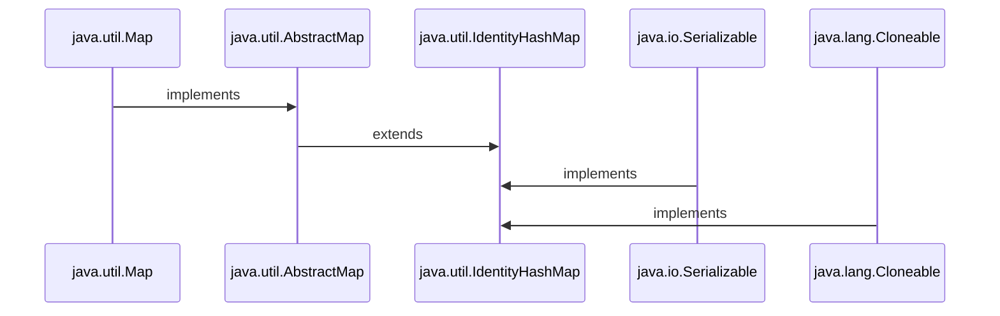

<li> <h3> 1. A IdentityHashMap is an extension of the AbstractMap class and it implements the Map interface. </h3> </li>
<li> <h3> 2. It is not synchronized and must be synchronized externally. </h3> </li>
<li> <h3> 3. It uses reference equality rather than using the equals() method. It uses the == operator. </h3> </li>
<li> <h3> 4. Iterators are fail-fast, throw ConcurrentModificationException in an attempt to modify while iterating.ConcurrentModificationException exception may be thrown by methods that have detected concurrent modification of an object when such modification is not permissible.</h3> </li>

<h3 align="Center">

```Syntax

public class IdentityHashMap<K,​V> extends AbstractMap<K,​V> implements Map<K,​V> 
,Serializable, Cloneable 

```
</h3>
<h2></h2>
<h2 align="Center">Constructors of IdentityHashMap </h2>
<ul>

<li><h3> <a href="https://github.com/AvinandanBose/JavaUtilMap/blob/main/constructIdentityHashMap.java"> 1.IdentityHashMap()</h3></li>

```Syntax
Constructs a new, empty identity hash map with a default expected maximum size (21).
    
```

<li><h3> <a href="https://github.com/AvinandanBose/JavaUtilMap/blob/main/constructIdentityHashMap1.java"> 2.IdentityHashMap(int ExpectedMaxSize)</h3></li>

```Syntax
It creates a new and empty identity hash map with the given specified expected maximum size.

Constructs a new, empty map with the specified expected maximum size. 
Putting more than the expected number of key-value mappings into the map ,
may cause the internal data structure to grow, which may be somewhat time-consuming.
    
```

<li><h3> <a href="https://github.com/AvinandanBose/JavaUtilMap/blob/main/constructIdentityHashMap2.java"> 3.IdentityHashMap(Map m)</h3></li>

```Syntax
It creates a new identity hash map with the key-value pairs given in the specified map.

Constructs a new identity hash map containing the keys-value mappings in the specified map.
    
```

<table>
 <tr>
    <th>Constructor</th>
    <th>Does This</th>
    
   
</tr> 

<tr>
  <td >IdentityHashMap()</td>
  <td >Constructs a new, empty identity hash map with a default expected maximum size (21).</td>
</tr>
<tr>
  <td >IdentityHashMap(int ExpectedMaxSize)</td>
  <td >It creates a new and empty identity hash map with the given specified expected maximum size.
Constructs a new, empty map with the specified expected maximum size. 
Putting more than the expected number of key-value mappings into the map ,
may cause the internal data structure to grow, which may be somewhat time-consuming.</td>
</tr>

<tr>
  <td >IdentityHashMap(Map m)</td>
  <td >It creates a new identity hash map with the key-value pairs given in the specified map.

Constructs a new identity hash map containing the keys-value mappings in the specified map.</td>
</tr>

</table>

</ul>
<h2></h2>
<h2 align="Center">Methods of IdentityHashMap </h2>
<ul>
<li><h3> <a href="https://github.com/AvinandanBose/JavaUtilMap/blob/main/IdentityHashMap1.java"> 1. All HashMap and AbstractMap Functions in IdentityHashMap</h3></li>
<li><h3> 2. Difference between HashMap and Identity HashMap.</h3></li>
<ul>
<li><h3> <a href="https://github.com/AvinandanBose/JavaUtilMap/blob/main/IdentityHashMap2.java">  Difference between HashMap and Identity HashMap</h3></li>

```Syntax

For Hash Map:

map.put("a", 1);

a is a String constant and 1 is Integer constant.

map.put(new String("a"), 2);

Here a is an object of String and 2 is an Integer constant.

But in HashMap it check key as :

map.put("a", 1).equals(map.put(new String("a"), 1));

i.e., it treats constant and object is equal as Keys are same i.e. "a".

i.e. "a".equals("a")

Which returns true , where as:

For Identity Hash Map:

map1.put("a", 1).equals(map1.put(new String("a"), 1))

Here it treats constant and object are different i.e.

"a" not equal to {new String("a")}

i.e. it uses:

"a" == {new String("a")} which is false

Hence it creates : {a=1,a=1} map


Now in Identity Hash Map: 

 map1.put("a", 2); will update,
 1st Key which have String constant ,
 
 i.e. : {a=2,a=1}
 
map1.put(new String("a"), 2); will update,
2nd Key which have String object ,

 i.e. : {a=2,a=2}
 
 While for HashMap:
 map.put("a", 1);
 = {a=1}
 map.put(new String("a"),2}
 =  {a=2}
 map.put("a",3}
 =  {a=3}
 
 .... etc
 
 This is the differnce between Hash Map and Identity Map.
```
</ul>
</ul>
<h2></h2>
<h2 align="Center">Synchronized IdentityHashMap </h2>
<ul>
<h3>
When more than one threads access the identity hash map concurrently, and at least one of the threads structurally modifies the map, it is necessary to synchronize that map externally. (Structural modification of map is to add or delete one or more key value mappings. If we just change the value associated with a key that an instance contains already is not structural modification.)
</h3>

<h3>
It can be achieved by synchronizing on any object that encapsulate the map. If such object doesn't exist, map should be wrapped with the help of Collections.synchronizedMap() method. The correct time to do this is at the time of creation, in order to prevent unsynchronized access to map.
</h3>
<ul>
<li><h3> <a href="https://github.com/AvinandanBose/JavaUtilMap/blob/main/synchronizedIdentityHashMap.java"> Synchronized Identity HashMap</h3></li>
</ul>

</ul>
</ul>

<h1></h1>
<h1 align="Center">Weak Hash Map </h1>

<ul>

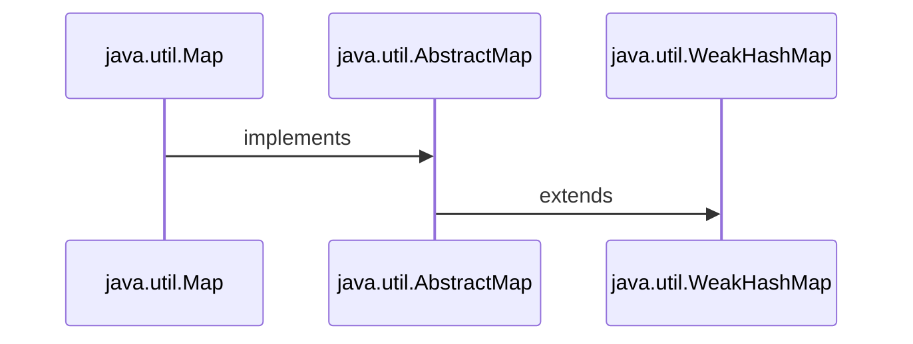

<h3 align="Center">

```Syntax

public class WeakHashMap<K,V> extends AbstractMap<K,V> implements Map<K,V>

```

</h3>

<li><h3>1. <i><ins>WeakHashMap</ins></i> is an implementation of the Map interface, that stores only weak references to its keys. </h3></li>
<li><h3>2. Storing only weak references allows a key-value pair to be garbage-collected when its key is no longer referenced outside of the WeakHashMap. </h3></li>
<li><h3>3. <i><ins>WeakHashMap</ins></i>  does not implement <i><ins>Cloneable interface</ins></i>, hence it doesnot have <i><ins>clone()</ins></i> functionality. </h3></li>

<li><h3>4. If object is specified as key doesn’t contain any references- it is eligible for <i><ins>Garbage Collection</ins></i> even though it is associated with <i><ins>WeakHashMap</ins></i>. i.e. <i><ins>Garbage Collector</ins></i> dominates over <i><ins>WeakHashMap</ins></i>. </h3></li>


<li><h3>5. In <i><ins>WeakHashmap</ins></i>, When a key is discarded then its entry is automatically removed from the map, in other words, garbage collected. </h3></li>

<h2> </h2>
<h2 align="Center"> <i>WeakReference Vs Strong Reference[on Reference to Hash Map and Weak Map]</i> </h2>
<ul>
<h3><i>1.Strong Reference:</i></h3>

```Syntax

public class example {
    public static void main(String[] args) {
        example obj = new example();
        obj = null;
        System.gc();
    }
    
    
}

```

<h3><i>Here "obj" object has strong reference to the instance of class "example" .</i></h3>
<h3><i>Hence Not eligible for garbage collection until:</i></h3>


```Syntax

obj = null 

```
<h3><i>i.e. The object is garbage collected only when the variable which was strongly referenced points to null.</i></h3>
<h3><i>As 'obj' object is no longer referencing to the instance of class: "example".</i></h3>
<h3><i><ins>Best example:</ins></i></h3>

```Syntax

class ex{
    public void finalize(){
        System.out.println("Finalize method called");
    }
}
public class example {
    public static void main(String[] args) {
        ex obj = new ex();
        obj.finalize();
        obj = null;
        System.gc();//Garbage Collector
        obj.finalize();//will not call finalize method and throws Null Pointer Exception
    }
    
    
}

```
<ul>
<li><h3> <a href="https://github.com/AvinandanBose/JavaUtilMap/blob/main/StrongRefexample.java"> Strong Reference Example</h3></li>
</ul>
<h3><i><ins>In HashMap, key objects have strong references. </ins></i></h3>

</ul>

<h3><i>2.Weak Reference:</i></h3>
<ul>
<li><h3>1. This type of reference is used in <i><ins>WeakHashMap</ins></i> to reference the entry objects . </h3></li>
<li><h3>2. If JVM detects an object with only weak references (i.e. no strong or soft references linked to any object), this object will be marked for garbage collection. </h3></li>
<li><h3>3. To create such references <i><ins>java.lang.ref.WeakReference</ins></i> class is used. </h3></li>
<li><h3>4. Weak Reference Objects are not the default type/class of Reference Object. They are explicitly specified while using them.</h3></li>

```Syntax

import java.lang.ref.WeakReference;

class exceptions {
    void print() {
        System.out.println("Print method called");
    }
}

public class WeakRefexample {
    public static void main(String[] args) {

        // Strong Reference
        exceptions obj = new exceptions();
        obj.print();

        // Weak Reference has explicit type class[exceptions] of Reference Object[obj]
        WeakReference<exceptions> weak = new WeakReference<>(obj); 

        obj = null;
        exceptions obj1 = weak.get();

        /**
         * 
         * get() function : It returns this reference object's referent.
         * If this reference object has been cleared,
         * either by the program or by the garbage collector,
         * then this method returns null.
         * 
         **/

        obj1.print(); // will call print method and will not throw any exceptions
    }

}

```
<ul>
<li><h3> <a href="https://github.com/AvinandanBose/JavaUtilMap/blob/main/WeakRefexample.java"> Weak Reference Example</h3></li>
</ul>
</ul>
<h2></h2>
<h2 align="Center">Constructors of WeakHashMap </h2>
<ul>

<li><h3> <a href="https://github.com/AvinandanBose/JavaUtilMap/blob/main/constructWeakHashMap.java"> 1.WeakHashMap()</h3></li>

```Syntax

It is used to construct a default constructor of WeakHashMap.

This constructor constructs a new, 
empty WeakHashMap with the default initial capacity (16) 
and the default load factor (0.75).
    
```
<li><h3> <a href="https://github.com/AvinandanBose/JavaUtilMap/blob/main/constructWeakHashMap1.java"> 2.WeakHashMap(int initialCapacity)</h3></li>

```Syntax

This constructor constructs a new, 
empty WeakHashMap with the given 
initial capacity and 
the default load factor, which is 0.75.
    
```

<li><h3> <a href="https://github.com/AvinandanBose/JavaUtilMap/blob/main/constructWeakHashMap2.java"> 3.WeakHashMap(int initialCapacity, float loadFactor)</h3></li>

```Syntax

This constructor constructs a new, empty WeakHashMap 
with the given initial capacity and the given load factor.
    
```

<li><h3> <a href="https://github.com/AvinandanBose/JavaUtilMap/blob/main/constructWeakHashMap3.java"> 4.WeakHashMap(Map m)</h3></li>

```Syntax

This constructor constructs a new WeakHashMap ,
with the same mappings as the specified Map.
    
```

<table>
 <tr>
    <th>Constructor</th>
    <th>Does This</th>
    
   
</tr> 
<tr>
  <td >WeakHashMap()</td>
  <td >It is used to construct a default constructor of WeakHashMap.This constructor constructs a new, 
empty WeakHashMap with the default initial capacity (16) 
and the default load factor (0.75).</td>
</tr>

<tr>
  <td >WeakHashMap(int initialCapacity)</td>
  <td >This constructor constructs a new, 
empty WeakHashMap with the given 
initial capacity and 
the default load factor, which is 0.75.</td>
</tr>


<tr>
  <td >WeakHashMap(int initialCapacity, float loadFactor)</td>
  <td >This constructor constructs a new, empty WeakHashMap 
with the given initial capacity and the given load factor.</td>
</tr>


<tr>
  <td >WeakHashMap(Map m)</td>
  <td >This constructor constructs a new WeakHashMap ,
with the same mappings as the specified Map.</td>
</tr>
</table>
</ul>
<h2></h2>
<h2 align="Center">Methods of WeakHashMap </h2>
<ul>
<li><h3> <a href="https://github.com/AvinandanBose/JavaUtilMap/blob/main/weakHashMap1.java"> 1.All Weak HashMap Methods</h3></li>
<li><h3> <a href="https://github.com/AvinandanBose/JavaUtilMap/blob/main/weakhashmap2.java"> 2. Weak HashMap Vs Hash Map</h3></li>

```Syntax
Consider a Class:

class demo{
    @Override
    public String toString() {
        return "demo";
    }
    public void finalize(){
        System.out.println("Finalize method called");
    }

}

Now:

class weakhashmap2{
 public static void main(String[] args){
  WeakHashMap<Object, Integer> map = new WeakHashMap<>();
  demo d = new demo();
  map.put(d, 1);
   
   Now:
   
   : Object is assigned to null :
   
   d = null;
   
   : And , Grabage Collector is called :
   
    System.gc();
    
    : Which will empty the Map as it is a Weak Reference :
    : As, Weak Reference is cleared by gc :
    
    Next:
    We input Key as d and an integer 1 in the map:
    map.put(d, 1);
    we know d has already assigned to null hence the output: Map:{null=1}
    
    Now we create another object say :
    demo d2 = new demo();
    map.put(d2, 2);
    
    So output will be: Map:{null=1,  demo=2}
    
    : Hence it signifies the WeakReference of Key, Value pair in Weak HashMap. :
    
    : But in Hash Map : 
    
    HashMap<Object, Integer> m = new HashMap<>();
    demo d1 = new demo();
    m.put(d1, 1);
    
    :Output: Map = {demo=1}
    
    d1 = null;//Object is referenced to null.
    System.gc();//garbage collector is called.
    
    :And again if map is called:
    :It will put Object → d1 and Integer→ 1 : 
    :As HashMap is strongly referenced to Object → d1 and Integer→ 1:
    
    System.out.println( m);
    
    :Output →  {demo=1}:
    
     Now we create another object say :
     demo d3 = new demo();
     m.put(d3, 2);
     System.out.println( m);
      
     :Output: Map = {demo=1, demo=2}
     
     :Note → d1,d2,d3 are different Objects of demo class :
     :And are reffered to here as different keys : 
     :For both HashMap and WeakHashMap : 
     
     
  }
}
   

```
</ul>
</ul>
<h1></h1>
<h1 align="Center">B.Sorted Map - Interface</h1>

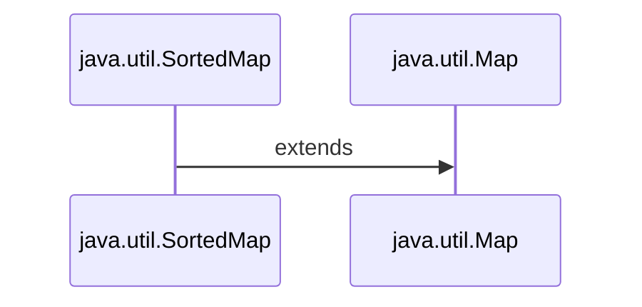

<h3 align="center">

```Syntax

public interface SortedMap<K, V> extends Map<K, V>

```

</h3>


<ul>
<li> <h3> SortedMap is an interface in the collection framework. </h3></li>

<li> <h3>This interface extends the Map interface and provides a total ordering of its elements ,
(elements can be traversed in sorted order of keys). </h3></li>

<li> <h3>The class that implements this interface is TreeMap.</h3></li>
<h2></h2>
<h2 align="Center">Methods of Sorted Map - Interface</h2>
<ul>
<li> <h3>1.Comparator() - Example</h3></li>
<ul>
<li><h3> <a href="https://github.com/AvinandanBose/JavaUtilMap/blob/main/SortedMap1.java"> 1.Comparator - Eg (1)</a></h3></li>
<li><h3> <a href="https://github.com/AvinandanBose/JavaUtilMap/blob/main/SortedMap2.java"> 2.Comparator - Eg (2)</a></h3></li>

```Syntax
Comparator:
A comparison function, which imposes a total ordering on some collection of objects. 
Comparators can also be used to control the order of  sorted maps .

Here: 
It returns the comparator used to order the keys in this map, 
or null if this map uses the natural ordering of its keys.

```
</ul>
<li><h3> <a href="https://github.com/AvinandanBose/JavaUtilMap/blob/main/SortedMap3.java"> 2.FirstKey()</a></h3></li>

```Syntax
Returns the first (lowest) key currently in this map.

```

<li><h3> <a href="https://github.com/AvinandanBose/JavaUtilMap/blob/main/SortedMap4.java"> 3.LastKey()</a></h3></li>

```Syntax
Returns the last (highest) key currently in this map.

```

<li><h3> <a href="https://github.com/AvinandanBose/JavaUtilMap/blob/main/SortedMap5.java"> 4.HeadMap(toKey:Key)</a></h3></li>

```Syntax

headMap(toKey:Key) : 
Returns a view of the portion of this map whose keys are strictly less than toKey.

```

<li><h3> <a href="https://github.com/AvinandanBose/JavaUtilMap/blob/main/SortedMap6.java"> 5.TailMap(fromKey:Key)</a></h3></li>

```Syntax

tailMap(fromKey:Key) : 
Returns a view of the portion of this map whose keys are greater than and equal to fromKey.

```
<li><h3> <a href="https://github.com/AvinandanBose/JavaUtilMap/blob/main/SortedMap7.java"> 6.SubMap(fromKey:Key, toKey:Key)</a></h3></li>

```Syntax

Returns a view of the portion of this map whose keys range from fromKey, inclusive, 
i.e. including fromKey and to toKey, exclusive i.e. excluding toKey.

```

<table>
 <tr>
    <th>Methods</th>
    <th>Does This</th>
    
   
</tr> 

<tr>
    <td>1.Comparator()</td>
    <td>

A comparison function, which imposes a total ordering on some collection of objects. 
Comparators can also be used to control the order of  sorted maps .
Here,It returns the comparator used to order the keys in this map, 
or null if this map uses the natural ordering of its keys.

</td>
      
</tr> 

<tr>
    <td>2.FirstKey()</td>
    <td>

Returns the first (lowest) key currently in this map.

</td>
      
</tr> 

<tr>
    <td>3.LastKey()</td>
    <td>

Returns the last (highest) key currently in this map.

</td>
      
</tr>

<tr>
    <td>4.HeadMap(toKey:Key)</td>
    <td>

Returns a view of the portion of this map whose keys are strictly less than toKey.

</td>
      
</tr>

<tr>
    <td>5.TailMap(fromKey:Key)</td>
    <td>

Returns a view of the portion of this map whose keys are greater than and equal to fromKey.

</td>
      
</tr>


<tr>
    <td>6.SubMap(fromKey:Key, toKey:Key)</td>
    <td>

Returns a view of the portion of this map whose keys range from fromKey, inclusive, 
i.e. including fromKey and to toKey, exclusive i.e. excluding toKey.

</td>
      
</tr>

</table>

<h3> <i> <ins>Note: </ins> SortedMap interface extends Map interface , hence it also inherits all functions from Map interface. </i></h3>
</ul>
</ul>

<h1></h1>
<h1 align="Center">C.Navigable Map - Interface</h1>

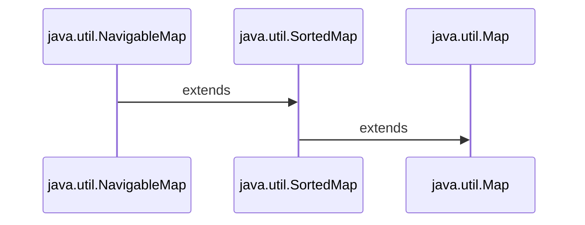


<h3 align="center">

```Syntax

public interface NavigableMap<K,V> extends SortedMap<K,V>

public interface SortedMap<K, V> extends Map<K, V>

```

</h3>

<ul>
<li> <h3> The NavigableMap interface is a member of the Java Collection Framework. </h3></li>

<li> <h3>A NavigableMap can be easily accessed and traversed in either ascending or descending key order. </h3></li>

<li> <h3>It belongs to java.util package and It is an extension of SortedMap which provides convenient navigation methods.</h3></li>
<li> <h3>As it extends Sorted Map , hence methods of all Sorted Map interface can be accessed by Navigable Map .</h3></li>
<li> <h3>These Navigation Methods  are discussed below.</h3></li>

<h2></h2>
<h2 align="center" > Methods of Navigable Map </h2>
<ul>

<li><h3> <a href="https://github.com/AvinandanBose/JavaUtilMap/blob/main/NavigableMap1.java"> 1.ceilingEntry</a></h3></li>

```Syntax
Returns a key-value mapping associated with the least key greater than 
or equal to the given key, or null if there is no such key.

```

<li><h3> <a href="https://github.com/AvinandanBose/JavaUtilMap/blob/main/NavigableMap2.java"> 2.ceilingKey</a></h3></li>

```Syntax
Returns the least key greater than or equal to the given key, 
or null if there is no such key.

```

<li><h3> <a href="https://github.com/AvinandanBose/JavaUtilMap/blob/main/NavigableMap3.java"> 3.descendingKeySet</a></h3></li>

```Syntax
Returns a reverse order NavigableSet view of the keys contained in this map.
The set's iterator returns the keys in descending order. 
The set is backed by the map, so changes to the map are reflected in the set, and vice-versa. 
If the map is modified while an iteration over the set is in progress 
(except through the iterator's own remove operation), the results of the iteration are undefined. 
The set supports element removal, which removes the corresponding mapping from the map, 
via the Iterator.remove, Set.remove, removeAll, retainAll, and clear operations. 

:It does not support the add or addAll operations:

```

<li><h3> <a href="https://github.com/AvinandanBose/JavaUtilMap/blob/main/NavigableMap4.java"> 4.descendingMap</a></h3></li>

```Syntax
Returns a reverse order view of the mappings contained in this map. 

```

<li><h3> <a href="https://github.com/AvinandanBose/JavaUtilMap/blob/main/NavigableMap5.java"> 5.firstEntry</a></h3></li>

```Syntax
Returns a key-value mapping associated with the least key in this map, 
or null if the map is empty.

```

<li><h3> <a href="https://github.com/AvinandanBose/JavaUtilMap/blob/main/NavigableMap6.java"> 6.floorEntry</a></h3></li>

```Syntax
Returns a key-value mapping associated with the greatest key less than 
or equal to the given key, or null if there is no such key.

```

<li><h3> <a href="https://github.com/AvinandanBose/JavaUtilMap/blob/main/NavigableMap7.java"> 7.floorKey</a></h3></li>

```Syntax
Returns the greatest key less than or equal to the given key,
or null if there is no such key.

```

<li><h3> <a href="https://github.com/AvinandanBose/JavaUtilMap/blob/main/NavigableMap8.java"> 8.headMap(K toKey, boolean inclusive)</a></h3></li>

```Syntax
Returns a view of the portion of this map whose keys are less than 
(or equal to, if inclusive is true) toKey.

if true:
Returns a view of the portion of this map whose keys are equal to toKey,if inclusive is true.

if false:
Returns a view of the portion of this map whose keys are less than toKey,if inclusive is false.

```

<li><h3> <a href="https://github.com/AvinandanBose/JavaUtilMap/blob/main/NavigableMap9.java"> 9.higherEntry</a></h3></li>

```Syntax
Returns a key-value mapping associated with the least key strictly greater than the given key,
or null if there is no such key.

```

<li><h3> <a href="https://github.com/AvinandanBose/JavaUtilMap/blob/main/NavigableMap10.java"> 10.higherKey</a></h3></li>

```Syntax
Returns the least key strictly greater than the given key, or null if there is no such key.

```

<li><h3> <a href="https://github.com/AvinandanBose/JavaUtilMap/blob/main/NavigableMap11.java"> 11.lastEntry</a></h3></li>

```Syntax
Returns a key-value mapping associated with the greatest key in this map, 
or null if the map is empty.

```

<li><h3> <a href="https://github.com/AvinandanBose/JavaUtilMap/blob/main/NavigableMap12.java"> 12.lowerEntry</a></h3></li>

```Syntax
Returns a key-value mapping associated with the greatest key strictly less than the given key, 
or null if there is no such key.

```

<li><h3> <a href="https://github.com/AvinandanBose/JavaUtilMap/blob/main/NavigableMap13.java"> 13.lowerKey</a></h3></li>

```Syntax
Returns the greatest key strictly less than the given key, or null if there is no such key.

```

<li><h3> <a href="https://github.com/AvinandanBose/JavaUtilMap/blob/main/NavigableMap14.java"> 14.navigableKeySet</a></h3></li>

```Syntax

Returns a NavigableSet view of the keys contained in this map. 
The set's iterator returns the keys in ascending order. 
The set is backed by the map, so changes to the map are reflected in the set, and vice-versa. 
The set supports element removal, which removes the corresponding mapping from the map, 
via the Iterator.remove, Set.remove, removeAll, retainAll, and clear operations. 


:It does not support the add or addAll operations:

```

<li><h3> <a href="https://github.com/AvinandanBose/JavaUtilMap/blob/main/NavigableMap15.java"> 15.pollFirstEntry</a></h3></li>

```Syntax

Removes and returns a key-value mapping associated with the least key in this map, 
or null if the map is empty.

```

<li><h3> <a href="https://github.com/AvinandanBose/JavaUtilMap/blob/main/NavigableMap16.java"> 16.pollLastEntry</a></h3></li>

```Syntax

Removes and returns a key-value mapping associated with the greatest key in this map, 
or null if the map is empty.

```


<li><h3> <a href="https://github.com/AvinandanBose/JavaUtilMap/blob/main/NavigableMap17.java"> 17.SubMap( fromKey:Key, boolean fromInclusive:true/false, toKey:Key, boolean toInclusive:true/false)</a></h3></li>

```Syntax

Returns a view of the portion of this map whose keys range from fromKey to toKey. 
If fromKey and toKey are equal, the returned map is empty 
unless fromInclusive and toInclusive are both true.

```

<li><h3> <a href="https://github.com/AvinandanBose/JavaUtilMap/blob/main/NavigableMap18.java"> 18.tailMap(fromKey :Key, boolean inclusive: true/false)</a></h3></li>

```Syntax

Returns a view of the portion of this map whose keys are greater than, 
(or equal to, if inclusive is true) fromKey.

```

<table>
 <tr>
    <th>Methods</th>
    <th>Does This</th>
    
</tr> 
<tr>
  <td >1.ceilingEntry</td>
  <td >
Returns a key-value mapping associated with the least key greater than 
or equal to the given key, or null if there is no such key.

</td> 
  
</tr>
<tr>
  <td >2.ceilingKey</td>
  <td >
Returns the least key greater than or equal to the given key, 
or null if there is no such key.
</td> 
</tr>
<tr>
  <td >3.descendingKeySet</td>
  <td >

Returns a reverse order NavigableSet view of the keys contained in this map.
The set's iterator returns the keys in descending order. 
The set is backed by the map, so changes to the map are reflected in the set, and vice-versa. 
If the map is modified while an iteration over the set is in progress 
(except through the iterator's own remove operation), the results of the iteration are undefined. 
The set supports element removal, which removes the corresponding mapping from the map, 
via the Iterator.remove, Set.remove, removeAll, retainAll, and clear operations. 
It does not support the add or addAll operations.

</td> 
  
</tr>
<tr>
  <td>4.descendingMap</td>

<td>
Returns a reverse order view of the mappings contained in this map.

</td>
 
</tr>

<tr>
  <td>5.firstEntry</td>

<td>
Returns a key-value mapping associated with the least key in this map, 
or null if the map is empty.

</td>
 
</tr>

<tr>
  <td>6.floorEntry</td>

<td>
Returns a key-value mapping associated with the greatest key less than 
or equal to the given key, or null if there is no such key.

</td>
 
</tr>

<tr>
  <td>7.floorKey</td>

<td>
Returns the greatest key less than or equal to the given key,
or null if there is no such key.
</td>
 
</tr>


<tr>
  <td>8.headMap(K toKey, boolean inclusive)</td>

<td>
Returns a view of the portion of this map whose keys are less than 
(or equal to, if inclusive is true) toKey.

if true:
Returns a view of the portion of this map whose keys are equal to toKey,if inclusive is true.

if false:
Returns a view of the portion of this map whose keys are less than toKey,if inclusive is false.
</td>
 
</tr>

<tr>
  <td>9.higherEntry</td>

<td>
Returns a key-value mapping associated with the least key strictly greater than the given key,
or null if there is no such key.
</td>
 
</tr>

<tr>
  <td>10.higherKey</td>

<td>
Returns the least key strictly greater than the given key, or null if there is no such key.
</td>
 
</tr>

<tr>
  <td>11.lastEntry</td>

<td>
Returns a key-value mapping associated with the greatest key in this map, 
or null if the map is empty.
</td>
 
</tr>

<tr>
  <td>12.lowerEntry</td>

<td>
Returns a key-value mapping associated with the greatest key strictly less than the given key, 
or null if there is no such key.
</td>
 
</tr>

<tr>
  <td>13.lowerKey</td>

<td>
Returns the greatest key strictly less than the given key, or null if there is no such key.
</td>
 
</tr>

<tr>
  <td>14.navigableKeySet</td>

<td>
Returns a NavigableSet view of the keys contained in this map. 
The set's iterator returns the keys in ascending order. 
The set is backed by the map, so changes to the map are reflected in the set, and vice-versa. 
The set supports element removal, which removes the corresponding mapping from the map, 
via the Iterator.remove, Set.remove, removeAll, retainAll, and clear operations. 
It does not support the add or addAll operations.
</td>
 
</tr>

<tr>
  <td>15.pollFirstEntry</td>

<td>
Removes and returns a key-value mapping associated with the least key in this map, 
or null if the map is empty.
</td>
 
</tr>

<tr>
  <td>16.pollLastEntry</td>

<td>
Removes and returns a key-value mapping associated with the greatest key in this map, 
or null if the map is empty.
</td>
 
</tr>


<tr>
  <td>17.SubMap( fromKey:Key, boolean fromInclusive:true/false, toKey:Key, boolean toInclusive:true/false)</td>

<td>
Returns a view of the portion of this map whose keys range from fromKey to toKey. 
If fromKey and toKey are equal, the returned map is empty 
unless fromInclusive and toInclusive are both true.
</td>
 
</tr>


<tr>
  <td>18.tailMap(fromKey :Key, boolean inclusive: true/false)</td>

<td>
Returns a view of the portion of this map whose keys are greater than, 
(or equal to, if inclusive is true) fromKey.
</td>
 
</tr>
</table>


</ul>
</ul>

<h1></h1>
<h1 align="Center">Tree Map</h1> 

<ul>

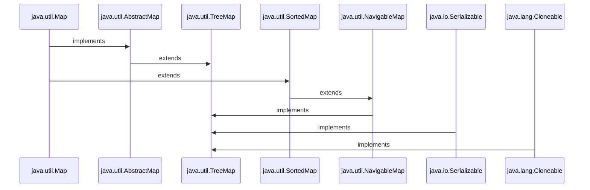

<h3 align="Center">

```Syntax

public class TreeMap<K,V> extends AbstractMap<K,V>
                          implements NavigableMap<K,V>,Cloneable,Serializable

public interface NavigableMap<K,V> extends SortedMap<K,V>

public interface SortedMap<K,V> extends Map<K,V>

```

</h3>

<li> <h3>1. The TreeMap in Java is used to implement Map interface . </h3></li>
<li> <h3>2. The TreeMap in Java is used to implement  NavigableMap interface . </h3></li>
<li> <h3>3. The TreeMap in Java is used to extend the abstract class :  <i>"AbstractMap"</i> . </h3></li>
<li> <h3>4.TreeMap in Java does not allow null keys (like Map) and thus a NullPointerException is thrown.</h3></li>
<li> <h3>5.Multiple null values can be associated with different keys in Tree Map.</h3></li>
<li> <h3>6.TreeMap contains only unique elements.</h3></li>
<li> <h3>7.TreeMap is non synchronized.</h3></li>
<li> <h3>8.TreeMap maintains ascending order. As Tree Map implements <i>" Navigable Map" </i> and Navigable Map extends Sorted Map.
Hence tree map maintains sorted structure of map i.e. in ascending order.</h3></li>
<li> <h3>9.<i>" Entry pairs " </i> returned by the methods in this class and its views represent snapshots of mappings at the time they were produced. <i>" Entry.SetValue "</i>  is only supported when we try to change every specific values of the keys through a loop , But do not support the <i>" Entry.setValue "</i> method for individual entries.And they throw <i> "Unsupported Operation Exception" .</i> </h3></li>
<ul>
<li><h3> <a href="https://github.com/AvinandanBose/JavaUtilMap/blob/main/TreeMap.java">Entry.SetValue in TreeMap → Eg</h3></li>
</ul>

<h2></h2>
<h2 align="Center">Constructors of TreeMap </h2>
<ul>
<li><h3> <a href="https://github.com/AvinandanBose/JavaUtilMap/blob/main/TreeMap1.java"> 1.TreeMap()</h3></li>

```Syntax
It is used to construct a default constructor of TreeMap.

It is used to construct an empty tree map,
that will be sorted using the natural order of its key.
    
```
<h3>2. TreeMap(Comparator<? super K> comparator) </h3>

```Syntax
It is used to construct an empty tree-based map,
that will be sorted using the comparator. 
    
```

<ul>

<li><h3> <a href="https://github.com/AvinandanBose/JavaUtilMap/blob/main/TreeMap2.java"> 2.a.TreeMap(Comparator<? super K> comparator)→Eg:1</h3></li>

```Syntax

Acc. to above eg:

TreeMap2(no:1, name:"one", value:1)

o1 and o2 are two object of TreeMap2,

Therefore Comparison:

o1.value - o2.value,
i.e,1st Diff: 1-1 = 0

TreeMap2(no:2, name:"two", value:2)

Therefore Comparison:

2nd Difference: 2-1 = 1

TreeMap2(no:3, name:"three", value:3)

o1.value: 3 - o2.value: 1 = 2

o1.value: 3 - o2.value: 2 = 1

TreeMap2(no:4, name:"four", value:4)

o1.value: 4 - o2.value: 2 = 2

o1.value: 4 - o2.value: 3 = 1

Similary:
TreeMap2(no:5, name:"five", value:5)

o1.value: 5 - o2.value: 2 = 3

o1.value: 5 - o2.value: 3 = 2

o1.value: 5 - o2.value: 4 = 1


....etc.

Hence:

if we see the comparison:

0 1 2 3 4 5 in ascending order.

Hence Result is in  ascending order.

```


<li><h3> <a href="https://github.com/AvinandanBose/JavaUtilMap/blob/main/TreeMap3.java"> 2.b.TreeMap(Comparator<? super K> comparator)→Eg:2</h3></li>


```Syntax

Acc. to above eg:

TreeMap2(no:1, name:"one", value:1)

o1 and o2 are two object of TreeMap2,

Therefore Comparison:

o2.value - o1.value,
i.e,1st Diff: 1-1 = 0

TreeMap2(no:2, name:"two", value:2)

Therefore Comparison:

2nd Difference: 1-2 = -1

TreeMap2(no:3, name:"three", value:3)

o2.value: 1 - o1.value: 3 = -2

o2.value: 2 - o1.value: 1 = -1

TreeMap2(no:4, name:"four", value:4)

o2.value: 2 - o1.value: 4 = -2

o2.value: 3 - o1.value: 4 = -1

Similary:
TreeMap2(no:5, name:"five", value:5)

o2.value: 2 - o2.value: 5 = -3

o2.value: 3 - o2.value: 5 = -2

o2.value: 4 - o2.value: 5 = -1


....etc.

Hence:

if we see the comparison:

-5 -4 -3 -2 -1 0 in descending order.

Hence Result is in descending order.

```

</ul>

<li><h3> <a href="https://github.com/AvinandanBose/JavaUtilMap/blob/main/TreeMap4.java"> 3.TreeMap(Map<? extends K,? extends V> m)</h3></li>

```Syntax

It is used to initialize a treemap with the entries from object of Map, 
which will be sorted using the natural order of the keys.

```

<li><h3> <a href="https://github.com/AvinandanBose/JavaUtilMap/blob/main/TreeMap5.java"> 4.TreeMap(SortedMap<K,? extends V> m)</h3></li>

```Syntax

It is used to initialize a treemap with the entries from object of SortedMap, 
which will be sorted using the natural order of the keys.

```

<li><h3> <a href="https://github.com/AvinandanBose/JavaUtilMap/blob/main/TreeMap6.java"> 5.TreeMap(NavigableMap<K,? extends V> m)</h3></li>

```Syntax

It is used to initialize a treemap with the entries from object of NavigableMap, 
which will be sorted using the natural order of the keys.

Note :  NavigableMap extends SortedMap
And : TreeMap implements NavigableMap

```

<table>
 <tr>
    <th>Constructor</th>
    <th>Does This</th>
    
   
</tr> 

<tr>
    <td>1.TreeMap()</td>
    <td>

It is used to construct a default constructor of TreeMap.

It is used to construct an empty tree map,
that will be sorted using the natural order of its key.

</td>
      
</tr> 

<tr>
    <td>2.TreeMap(Comparator<? super K> comparator)</td>
    <td>

It is used to construct an empty tree-based map,
that will be sorted using the comparator. 

</td>
      
</tr> 

<tr>
    <td>3.TreeMap(Map<? extends K,? extends V> m)</td>
    <td>

It is used to initialize a treemap with the entries from object of Map, 
which will be sorted using the natural order of the keys.

</td>
      
</tr>

<tr>
    <td>4.TreeMap(SortedMap<K,? extends V> m)</td>
    <td>

It is used to initialize a treemap with the entries from object of SortedMap, 
which will be sorted using the natural order of the keys.

</td>
      
</tr>

<tr>
    <td>5.TreeMap(NavigableMap<K,? extends V> m)</td>
    <td>

It is used to initialize a treemap with the entries from object of NavigableMap, 
which will be sorted using the natural order of the keys.

Note :  NavigableMap extends SortedMap,
And : TreeMap implements NavigableMap.

</td>
      
</tr>

</table>

</ul>
<h2></h2>
<h2 align="Center">Methods of TreeMap </h2>
<ul>
<li><h3> <a href="https://github.com/AvinandanBose/JavaUtilMap/blob/main/TreeMapMethods.java"> 1.TreeMap Methods</h3></li>
<h3><ins><i>Note:</ins> These methods are already part of WeakHashMap , IdentityHashMap and HashMap .</i> </h3>

<li><h3> <a href="https://github.com/AvinandanBose/JavaUtilMap/blob/main/TreeMapMethods2.java"> 2.TreeMap Methods[Sorted Map Interface Methods]</h3></li>
<h3><ins><i>Note:</ins> These methods are already part of Sorted Map Interface Methods, as TreeMap implements NavigableMap and NavigableMap extends SortedMap .</i> </h3>

<li><h3> <a href="https://github.com/AvinandanBose/JavaUtilMap/blob/main/TreeMapMethods3.java"> 3.TreeMap Methods[Navigable Map Interface Methods]</h3></li>

```Syntax
Suppose we have descendingKeySet() or navigableKeySet() functions:

Then:

The Set that will be produced by those function can be reserved in Set variable/object.

1. Set<Type> set_var = TreeMap.navigableKeySet();

2. Set<Type> set_var = TreeMap.descendingKeySet();

Similary for Entry say, lastEntry() or pollFirstEntry():

Then: 

It calls for Maps.Entry and reserves such entries under its variable/object.

i.e. 
Import java.util.Map.Entry;
Entry<Type1, Type2> entry_var = TreeMap.pollLastEntry();

or:
Map.Entry <Type1, Type2> entry_var = TreeMap.pollLastEntry();

Similary for tailMap() or subMap() type Functions:

They are always stored under the Map object/variable.

i.e.

 Map<Type1, Type2> map_var = TreeMap.tailMap(fromKey:Key, inclusive: true/false);
 
 If we want to store any key object then it can be store under it's type varibale:
 
 Eg:
 TreeMap<Float, String> treeMap = new TreeMap<>();
 Float float_var = treeMap.lowerKey(4.0f);

```

<h3><ins><i>Note:</ins> These methods are already part of Navigable Map Interface Methods, as TreeMap implements NavigableMap  .</i> </h3>
</ul>

</ul>

<h2></h2>
<h2 align="Center">Synchronization of TreeMap </h2>
<ul>
<h3>
The implementation of a TreeMap is not synchronized. This means that if multiple threads access a tree set concurrently, and at least one of the threads modifies the set, it must be synchronized externally. This is typically accomplished by using the <i><ins>Collections.synchronizedSortedMap</ins></i> method. Also it can be locked by <i><ins>synchronized()</ins></i> method and all such map objects can execute synchronized in a single thread.
</h3>
<ul>
<li><h3> <a href="https://github.com/AvinandanBose/JavaUtilMap/blob/main/synchronizedTreeMap.java"> SynchronizedTreeMap</h3></li>
</ul>
</ul>
</ul>
<h1></h1>
<h1 align="Center">Enum Map </h1>

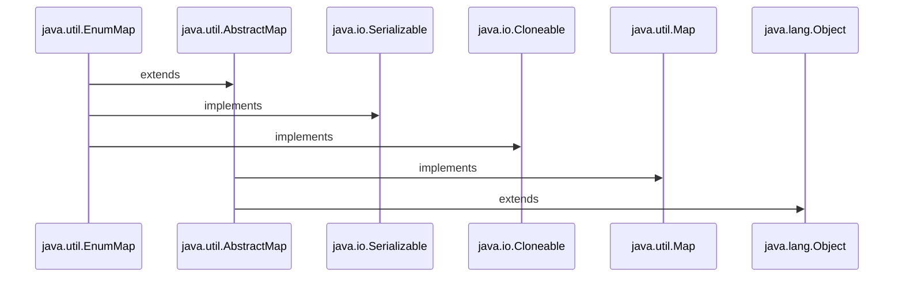

<h3 align="Center">

```Syntax

public class EnumMap<K extends Enum<K>,​V> 
                    extends AbstractMap<K,​V> 
                    implements Serializable, Cloneable

public abstract class AbstractMap<K,V> extends Object, implements Map<K,V>

```
</h3>

<ul>
<li> <h3>1. EnumMap class is a member of the Java Collections Framework .</h3></li>
<li> <h3>2. EnumMap extends AbstractMap and AbstractMap (abstract class) implement Map Interface.</h3></li>
<li> <h3>3. EnumMap doesn’t allow null key and throws NullPointerException .</h3></li>
<li> <h3>4. All keys of each EnumMap instance must be keys of a single enum(enumeration) type.</h3></li>
<li> <h3>5.It’s a high-performance map implementation, much faster than HashMap.</h3></li>
<li> <h3>6.<i><ins>Iterators</ins></i> returned by the collection views are weakly consistent: they will never throw <i><ins>ConcurrentModificationException</ins></i> and they may or may not show the effects of any modifications to the map that occur while the iteration is in progress.</h3></li>
<li> <h3>7.EnumMap is internally represented as arrays. This representation is extremely compact and efficient.</h3></li>

<h2></h2>
<h2 align="Center"> Constructors of EnumMap</h2>

<ul>
<li><h3> <a href="https://github.com/AvinandanBose/JavaUtilMap/blob/main/EnumMapConst1.java">1. EnumMap(Class keyType)</h3></li>

```Syntax

Creates an empty enum map with the specified key type.

```

<li><h3> <a href="https://github.com/AvinandanBose/JavaUtilMap/blob/main/EnumMapConst2.java">2. EnumMap(EnumMap m)</h3></li>


```Syntax

Creates an enum map with the same key type as the specified enum map,
initially containing the same mappings (if any).

```

<li><h3> <a href="https://github.com/AvinandanBose/JavaUtilMap/blob/main/EnumMapConst3.java">3. EnumMap(Map m)</h3></li>

```Syntax

It is used to create an enum map initialized from the specified map.

```

<table>
<tr>
    <th>Constructor</th>
    <th>Does This</th>
    
</tr> 
 
<tr>

 <td> 1 . EnumMap(Class keyType) </td>
  <td> 
  Creates an empty enum map with the specified key type.
  </td>
  
</tr> 

<tr>

 <td> 2 . EnumMap(EnumMap m) </td>
  <td> 
  Creates an enum map with the same key type as the specified enum map,
initially containing the same mappings (if any).
  </td>
  
</tr>

<tr>

 <td> 3 . EnumMap(Map m) </td>
  <td> 
 It is used to create an enum map initialized from the specified map.
  </td>
  
</tr>


</table>

</ul>

<h2></h2>
<h2 align="Center">Methods of EnumMap</h2>
<ul>
<li><h3> <a href="https://github.com/AvinandanBose/JavaUtilMap/blob/main/EnumMapMethods.java">Methods of EnumMap</h3></li>

```Syntax

Note : 

Map.values() returns a Collection , 
Hence the return value can be stored in object/variable of Collection.

import java.util.Collection;
Collection<Type> col_var =Map.values() ;

```
<h3><ins><i>Note:</ins> These methods are already discussed earlier.</i> </h3>

</ul>

</ul>

<h1></h1>
<h1 align="Center">D.ConcurrentMap -Interface</h1>

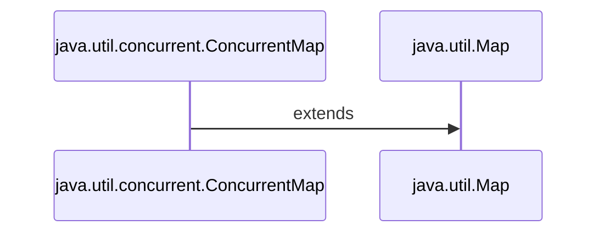

<h3 align="Center">

```Syntax

public interface ConcurrentMap<K,V> extends Map<K,V>

```

</h3>

<ul>
<li><h3> 1. ConcurrentMap is an interface and it is a member of the Java Collections Framework . </h3></li>
<li><h3> 2. ConcurrentMap is introduced in JDK 1.5 . </h3></li>
<li><h3> 3. ConcurrentMap represents a Map that is capable of handling concurrent access to the Map,without affecting the consistency of entries in a map . </h3></li>
<li><h3> 4. ConcurrentMap interface present in <i><ins>java.util.concurrent package</ins></i> . </h3></li>
<li><h3> 5. ConcurrentMap extends the Map interface in Java. </h3></li>
<li><h3> 6. ConcurrentMap is known as a synchronized Map. </h3></li>
<li><h3> 7. ConcurrentMap is implemented by ConcurrentSkipListMap and ConcurrentHashMap classes. </h3></li>

<h2></h2>
<h2 align="Center"> Methods of ConcurrentMap Interface</h2>
<ul>

<li><h3> <a href="https://github.com/AvinandanBose/JavaUtilMap/blob/main/concurrentMap1.java">Methods of ConcurrentMap Interface</h3></li>

```Syntax

Note:

For having all the entries of a Map as a Set:

We have entrySet() function:

It can be stored in Set's variable /object by:

Either:

Set<Map.Entry<keyType, valueType>> set_var = Map.entrySet();

Or:

import java.util.Map.Entry;

Set<Entry<keyType, valueType>> set_var = Map.entrySet();


```
<h3><ins><i>Note:</ins> These methods are already discussed earlier.</i> </h3>
</ul>
</ul>

<h1></h1>
<h1 align="Center">E.ConcurrentNavigableMap Interface</h1>

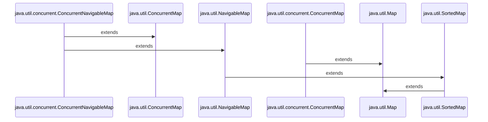

<h3 align="Center">

```Syntax

public interface ConcurrentNavigableMap<K,V> extends ConcurrentMap<K,V>
                                                 , NavigableMap<K,V>
                                                 
public interface ConcurrentMap<K,V> extends Map<K,V>
public interface NavigableMap<K,V> extends SortedMap<K,V>
public interface SortedMap<K, V> extends Map<K, V>


```

</h3>

<ul>
<li><h3> 1. The ConcurrentNavigableMap interface is a member of the Java Collection Framework . </h3></li>
<li><h3> 2. ConcurrentNavigableMap extends from the NavigableMap interface and ConcurrentMap interface . </h3></li>
<li><h3> 3. The ConcurrentNavigableMap provides thread-safe access to map elements along with providing convenient navigation methods . </h3></li>
<li><h3> 4. ConcurrentNavigableMap belongs to <i><ins>java.util.concurrent package</ins></i>. </h3></li>
<li><h3> 5. ConcurrentNavigableMap is SubInterface of ConcurrentMap interface . </h3></li>
<li><h3> 6. ConcurrentNavigableMap is also Synchronized , like ConcurrentMap interface . </h3></li>
<li><h3> 7. ConcurrentNavigableMap is implemented by ConcurrentSkipListMap class. </h3></li>

<h2></h2>
<h2 align="Center">Methods of ConcurrentNavigableMap </h2>
<ul>
<li><h3> <a href="https://github.com/AvinandanBose/JavaUtilMap/blob/main/concurrentNavigableMap1.java">Methods of ConcurrentNavigableMap Interface</h3></li>
</ul>
<h3><ins><i>Note:</ins> The methods of  ConcurrentNavigableMap Interface are inherited from SortedMap interface,,Map Interface,NavigableMap Interface and ConcurrentMap Interface.Hence some of them are discussed above.</i> </h3>
</ul>

<h1></h1>
<h1 align="Center">ConcurrentHashMap </h1>


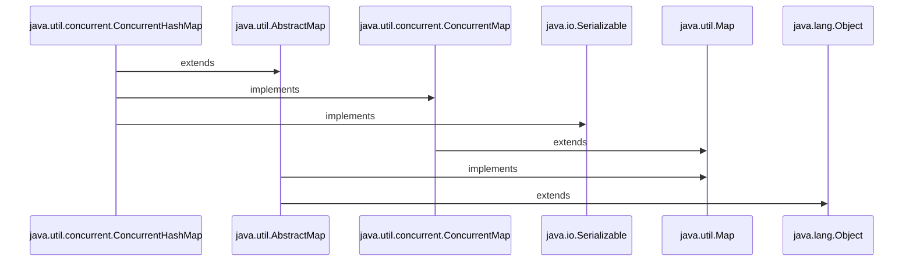

<h3 align="Center">

```Syntax

public class ConcurrentHashMap<K,​V> extends AbstractMap<K,​V> 
                                    implements ConcurrentMap<K,​V>, Serializable
                               
public interface ConcurrentMap<K,V> extends Map<K,V>

public abstract class AbstractMap<K,V> extends Object implements Map<K,V>

```

</h3>

<ul>

<li><h3>1.The ConcurrentHashMap class is introduced in JDK 1.5 . </h3></li>

<li><h3>2.The ConcurrentHashMap belongs to java.util.concurrent package.</h3></li>

<li><h3>3.The ConcurrentHashMap class is thread-safe i.e. multiple threads can operate on a single object without any complications i.e <i> <ins>Synchronization </ins> </i>.</h3></li>

<li><h3><i>4.Hashtable is thread safe but give poor performance in multi-threading.Hashmap can solve performance issue by giving parallel access to multiple threads reading hashmap simultaneously but Hashmap is not thread safe, hence ConcurrentHashMap is introduced in JDK 1.5. ConcurrentHashMap is thread safe ,it creates an array  and each index of this array represents a HashMap. And Hashtable and HashMap both uses array and linkedlist as the data structure to store the data. Hence ,we can say, the underlined data structure for ConcurrentHashMap is Hashtable. </i></h3></li>

<li><h3>5.The default concurrency-level of ConcurrentHashMap is 16.</h3></li>

<li><h3>6.In ConcurrentHashMap, the Object is divided into a number of segments according to the concurrency level.</h3></li>

<li><h3>7.In ConcurrentHashMap, at a time any number of threads can perform retrieval operation.</h3></li> 

<li><h3>8.In ConcurrentHashMap, to have a update in the object, the thread must lock the particular segment in which the thread wants to operate. This type of locking mechanism is known as <i><ins>Segment locking or bucket locking</ins></i>. Hence at a time, 16 update operations can be performed by threads as  default concurrency-level of ConcurrentHashMap is 16.</h3></li>

<li><h3>9.In ConcurrentHashMap, the higher the concurrency level, the more threads can access its buckets at once.</h3></li>

<li><h3>10.In ConcurrentHashMap class is designed for use in concurrent data access,i.e. accessing data at same time.</h3></li>

<li><h3>11.Inserting null objects is not possible in ConcurrentHashMap as a key or value.</h3></li>

<li><h3>12.The ConcurrentHashMap doesn’t throw a ConcurrentModificationException if one thread tries to modify it while another is iterating over it.</h3></li>

<h3><i> <ins>ConcurrentHashMap</ins> </i></h3>


<h3><i> <ins>In More Details</ins> </i></h3>


<h3><i><ins>Size of Segment  Calculation</ins></i></h3>


<h3><i><ins>Concurrency-Level</ins></i>: It is the number of threads concurrently updating the map.</h3>

<h3><i><ins>Segment in ConcurrentHashMap</ins></i> : In ConcurrentHashMap, the Object is divided into a number of segments according to the concurrency level.Each Segment has an Array of HashMap.</h3>
 
<h3><i>[Segment Size = 2^x >=(initialCapacity / concurrencyLevel)]</i></h3>


<h3>
If concurrency level = 10

Segment Size = 2^x >= 10

if x= 3 then  2^3 >= 10
		 = 8>=10 (Wrong)

Then,

x= 4 then  2^4 >= 10
           = 16>=10 (Right)

Hence Segment Size = 16

</h3>

<h2></h2>
<h2 align="Center">Constructors of ConcurrentHashMap </h2>
<ul>
<li><h3> <a href="https://github.com/AvinandanBose/JavaUtilMap/blob/main/constructConcurrentHashMap.java">1. ConcurrentHashMap()</h3></li>

```Syntax

Creates a new, empty map with a default initial capacity (16), 
load factor (0.75) and concurrencyLevel (16)

Initial Capacity: Number of elements initially that a map can have. 
if the capacity of this map is 10. It means that it can store 10 entries.

LoadFactor : 
The load factor is the measure that decides when to increase the capacity of the Map.
It’s a threshold, used to control resizing of the Map.

Concurrency-Level: It is the number of threads concurrently updating the map.
The implementation performs internal sizing to try to accommodate this many threads.

```
<li><h3> <a href="https://github.com/AvinandanBose/JavaUtilMap/blob/main/constructConcurrentHashMap1.java">2. ConcurrentHashMap(initialCapacity)</h3></li>

```Syntax

Creates a new, empty map with an initial table size,
accommodating the specified number of elements,
without the need to dynamically resize.

That is: Creates a new, 
empty map with the specified initial capacity, 
and with default load factor (0.75) and concurrencyLevel (16)

```

<li><h3> <a href="https://github.com/AvinandanBose/JavaUtilMap/blob/main/constructConcurrentHashMap2.java">3. ConcurrentHashMap(initialCapacity,loadFactor)</h3></li>

```Syntax

Creates a new empty map ,
with an initial table size based on the given number of elements (initialCapacity) 
and initial table density (loadFactor).

That is: Creates a new empty map ,
with the specified initial capacity and 
load factor and with the default concurrencyLevel (16).

```

<li><h3> <a href="https://github.com/AvinandanBose/JavaUtilMap/blob/main/constructConcurrentHashMap3.java">4. ConcurrentHashMap(initialCapacity,loadFactor,concurrencyLevel)</h3></li>

```Syntax

Creates a new, empty map with an initial table size,
based on the given number of elements (initialCapacity), 
table density (loadFactor), a
nd number of concurrently updating threads (concurrencyLevel).

That is: Creates a new, empty map 
with the specified initial capacity, 
load factor, and concurrency level

```

<li><h3> <a href="https://github.com/AvinandanBose/JavaUtilMap/blob/main/constructConcurrentHashMap4.java">5. ConcurrentHashMap(Map m)</h3></li>

```Syntax

Creates a new map with the same mappings as the given map.

```
</ul>

<h2></h2>
<h2 align="Center">Methods of ConcurrentHashMap </h2>
<ul>
<li><h3> <a href="https://github.com/AvinandanBose/JavaUtilMap/blob/main/ConcurrentHashMapMethods1.java">1. ConcurrentHashMap -- Methods</h3></li>
<h3><i><ins> Note: </ins>Here methods discussed are inherited from ConcurrentMap,AbstractMap,Map interfaces.</i></h3>

```Syntax

Note: Clone() method is not implemented by ConcurrentHashMap.
It belongs to Abstract Map which is not visible to the class.
If called then it throws exception : CloneNotSupportedException.
There is a reason why Clone() method not implemented in ConcurrentHashMap.
The reason is : ConcurrentHashMap is Thread Safe and 
creating a deep copy of the map would be difficult to implement .

```

<h3><i><ins>New Methods of ConcurrentHashMap </ins></i></h3>

<ul>
<li><h3> <a href="https://github.com/AvinandanBose/JavaUtilMap/blob/main/ConcurrentHashMapMethods2.java">2. forEach​(long parallelismThreshold, BiFunction<? super K,​? super V,​? extends U> transformer, Consumer<? super U> action) </h3></li>

```Syntax

Performs the given action for each non-null transformation of each (key, value).

The parallelismThreshold : 
It sets the number of items at which operations in a map begin to run concurrently.
It determines whether bulk operations would be executed sequentially or in parallel.

BiFunction: Represents a function that accepts two arguments and produces a result.

Transformer: The transformer transforms the data before sending it to the Consumer.

Consumer: It represents a functional interface which accepts 
a single input argument and produces no result.

```

<li><h3> <a href="https://github.com/AvinandanBose/JavaUtilMap/blob/main/ConcurrentHashMapMethods7.java">3. forEach​(long parallelismThreshold, BiConsumer<? super K,​? super V> action) </h3></li>

```Syntax

Performs the given action for each (key, value).

The parallelismThreshold : 
It sets the number of items at which operations in a map begin to run concurrently.
It determines whether bulk operations would be executed sequentially or in parallel.

BiFunction: Represents a function that accepts two arguments and produces a result.

```

<li><h3> <a href="https://github.com/AvinandanBose/JavaUtilMap/blob/main/ConcurrentHashMapMethods8.java">4. forEachEntry​(long parallelismThreshold, Consumer<? super Map.Entry<K,​V> action) </h3></li>

```Syntax

Performs the given action for each (key, value).

The parallelismThreshold : 
It sets the number of items at which operations in a map begin to run concurrently.
It determines whether bulk operations would be executed sequentially or in parallel.

Consumer: It represents a functional interface which accepts 
a single input argument and produces no result.


```

<li><h3> <a href="https://github.com/AvinandanBose/JavaUtilMap/blob/main/ConcurrentHashMapMethods9.java">5. forEachEntry​(long parallelismThreshold, Function<Map.Entry<K,​V>,​? extends U> transformer, Consumer<? super U> action) </h3></li>

```Syntax

Performs the given action for each non-null transformation of each entry.

The parallelismThreshold : 
It sets the number of items at which operations in a map begin to run concurrently.
It determines whether bulk operations would be executed sequentially or in parallel.

Function: It takes one argument and produces a result.

Transformer: The transformer transforms the data before sending it to the Consumer.

Consumer: It represents a functional interface which accepts 
a single input argument and produces no result.

```

<li><h3> <a href="https://github.com/AvinandanBose/JavaUtilMap/blob/main/ConcurrentHashMapMethods10.java">6. forEachKey​(long parallelismThreshold, Consumer<? super K> action) </h3></li>

```Syntax

Performs the given action for each non-null transformation of each entry.

The parallelismThreshold : 
It sets the number of items at which operations in a map begin to run concurrently.
It determines whether bulk operations would be executed sequentially or in parallel.

Consumer: It represents a functional interface which accepts 
a single input argument and produces no result.

```

<li><h3> <a href="https://github.com/AvinandanBose/JavaUtilMap/blob/main/ConcurrentHashMapMethods11.java">7. forEachKey​(long parallelismThreshold, Function<? super K,​? extends U> transformer, Consumer<? super U> action) </h3></li>

```Syntax

Performs the given action for each non-null transformation of each key.

The parallelismThreshold : 
It sets the number of items at which operations in a map begin to run concurrently.
It determines whether bulk operations would be executed sequentially or in parallel.

Function: It takes one argument and produces a result.

Transformer: The transformer transforms the data before sending it to the Consumer.

Consumer: It represents a functional interface which accepts 
a single input argument and produces no result.

```

<li><h3> <a href="https://github.com/AvinandanBose/JavaUtilMap/blob/main/ConcurrentHashMapMethods12.java">8. forEachKey​(long parallelismThreshold, Consumer<? super V> action) </h3></li>

```Syntax
Performs the given action for each value.

The parallelismThreshold : 
It sets the number of items at which operations in a map begin to run concurrently.
It determines whether bulk operations would be executed sequentially or in parallel.

Consumer: It represents a functional interface which accepts 
a single input argument and produces no result.

```

<li><h3> <a href="https://github.com/AvinandanBose/JavaUtilMap/blob/main/ConcurrentHashMapMethods13.java">9. forEachValue​(long parallelismThreshold, Function<? super V,​? extends U>transformer, Consumer<? super U> action) </h3></li>

```Syntax
Performs the given action for each non-null transformation of each value.

The parallelismThreshold : 
It sets the number of items at which operations in a map begin to run concurrently.
It determines whether bulk operations would be executed sequentially or in parallel.

Function: It takes one argument and produces a result.

Transformer: The transformer transforms the data before sending it to the Consumer.

Consumer: It represents a functional interface which accepts 
a single input argument and produces no result.

```

<li><h3> <a href="https://github.com/AvinandanBose/JavaUtilMap/blob/main/ConcurrentHashMapMethods3.java">10. keySet​(V mappedValue) </h3></li>

```Syntax

Returns a Set view of the keys in this map, 
using the given common mapped value for any additions 
(i.e., Collection.add and Collection.addAll(Collection)). 
This is of course only appropriate if it is acceptable ,
to use the same value for all additions from this view.

Which means if a Set's object is set to Map's keyset with 
its Mapped Value and if we continue to add with
Collection.add () function through set the , added
values will be refered as "Keys" of the map , automatically
gets added to Map as "Keys" gets mapped with the given Value.

Suppose we create an empty ConcurrentHashMap:

ConcurrentHashMap<String, String> map = new ConcurrentHashMap<>();

Set<String> set = map.keySet("1");
set.add("one");
System.out.println("Map:" + map);

Output:

Map:{one=1}

Similarly,

set = map.keySet("2");
set.add("two");

System.out.println("Map:" + map);

Output:

Map:{one=1, two=2}

....ETC.

Same for set.addAll() Functionality ,but here ,

Different keys will be assigned to Same Values.

Set<String> set2 =new HashSet<>();
set2.add("three");
set2.add("four");
set.addAll(set2);
System.out.println("Map:" + map);

Output:

Map:{one=1, two=2, three=2, four=2}

As last mapped value was 2.
 
 


```

<li><h3> <a href="https://github.com/AvinandanBose/JavaUtilMap/blob/main/ConcurrentHashMapMethods4.java">11. MappingCount </h3></li>

```Syntax

Returns the number of mappings. 

This method should be used instead of size . The reason is, 
a ConcurrentHashMap may contain more mappings,
than can be represented as an int. 
The value returned is an estimate; 
the actual count may differ ,
if there are concurrent insertions or removals.

```

<li><h3> <a href="https://github.com/AvinandanBose/JavaUtilMap/blob/main/ConcurrentHashMapMethods5.java">12. newKeySet() </h3></li>

```Syntax

Creates a new Set backed by a ConcurrentHashMap,
from the given type to Boolean.TRUE.

```
<li><h3> <a href="https://github.com/AvinandanBose/JavaUtilMap/blob/main/ConcurrentHashMapMethods6.java">13. newKeySet(int initialCapacity) </h3></li>

```Syntax

Creates a new Set backed by a ConcurrentHashMap,
from the given type to Boolean.TRUE.

```
<li><h3> <a href="https://github.com/AvinandanBose/JavaUtilMap/blob/main/ConcurrentHashMapMethods14.java">14. reduce​(long parallelismThreshold, BiFunction<? super K,​? super V,​? extends U> transformer, BiFunction<? super U,​? super U,​? extends U> reducer) </h3></li>

```Syntax

Returns the result of accumulating the given transformation ,
of all (key, value) pairs using the given reducer ,
to combine values, or null if none.

:Description of the Code is inside:

```

<li><h3> <a href="https://github.com/AvinandanBose/JavaUtilMap/blob/main/ConcurrentHashMapMethods15.java">15. reduceEntries​(long parallelismThreshold, BiFunction<Map.Entry<K,​V>,​Map.Entry<K,​V>,​? extends Map.Entry<K,​V>> reducer) </h3></li>

```Syntax

Returns the result of accumulating all entries ,
using the given reducer to combine values, or null if none.

```

</ul>

</ul>
</ul>
