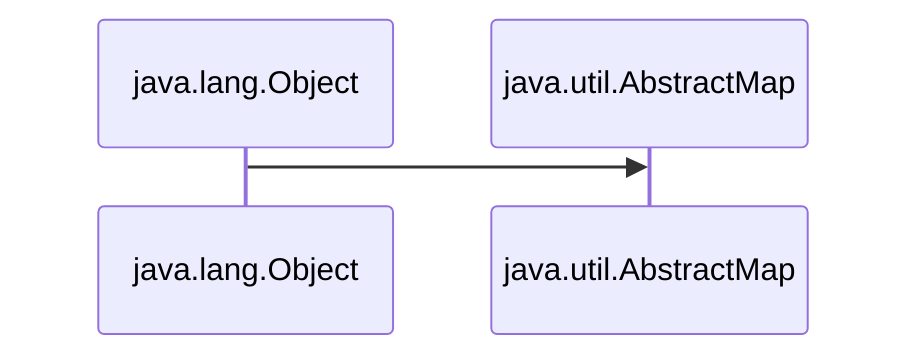
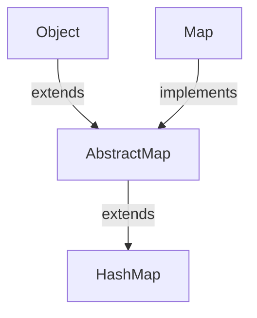

# JavaUtilMap
Here is all about Map of Java

<h1>1. AbstractMap </h1>
<ul>
<li> <h3> 1. Every class of Java is inherited  from <i> java.lang.Object </i>  </h3></li>
<li> <h3> 2. The <i> AbstractMap </i> class is the base class of the map classes in Java.</h3></li>



<li> <h3> 3. The <i>AbstractMap</i> class is a part of the Java Collection Framework.</h3></li>
<li> <h3> 4.  It directly implements the <i>Map</i> interface to provide a structure to it.</h3></li>
<li> <h3> 5.  <i>AbstractMap</i> is an abstract class, hence we cannot create <i>AbstractMap</i>'s Object but the concrete classes that inherit from <i>AbstractMap</i> can be used to create objects .</h3></li>

<br>

<table>
 <tr>
    <th>Interface</th>
    <th>Hash Table</th>
    <th>Resizable Array</th> 
   <th>Balanced Tree</th> 
   <th>Linked List</th> 
</tr> 
<tr>
  <td >Map</td>
  <td >HashMap</td> 
  <td ></td> 
  <td >TreeMap</td>
  <td ></td>
</tr>
<tr>
  <td >SortedMap</td>
  <td ></td> 
  <td ></td> 
  <td >TreeMap</td>
  <td ></td>
</tr>
<tr>
  <td >NavigableMap</td>
  <td ></td> 
  <td ></td> 
  <td >TreeMap</td>
  <td ></td>
</tr>
<tr>
  <td colspan="5">Map.Entry(Inner Class of Map)</td>
 
</tr>
</table>

<h3 align="center">

```Syntax

public abstract class AbstractMap<K,V> extends Object, implements Map<K,V>

```

</h3>

</ul>

<h1>2. Map Interface </h1>

<ul>
<li><h3>1. A <i> map</i> stores data in Key/Value pairs much like an array.</h3></li>
<li><h3>2. Every Key/Value pairs stored in indexes .</h3></li>
<li><h3>3. Every Key/Value pairs are stored as <i>Objects</i> in Java.</h3></li>
<li><h3>4. Typically , <i>keys</i> are Strings.</h3></li>
<li><h3>5. Given a Key and a Value, we can store the value in a <i>Map</i> object.</h3></li>
<li><h3>6. After the value is stored , we can retrieve it by using its Key.</h3></li>
<li><h3>7. Map is generic and is declared : </h3></li>

<h3 align="center">

```Syntax

interface Map<K,V>

```

</h3>


<h3> Where, <i>K</i> specifies the type of keys and <i>V</i> specifies the type of values. </h3>

<li><h3>8. Map do not implement the <i>Iterable</i> interface. Futhermore <i>Iterator</i> also cannot be obtained by a map.</h3></li>

<ul>

```Syntax

That is :

import java.util.Iterator;
import  java.lang.Iterable;

Iterable<Map<Key, Value>> itr = map; → Cannot be Obtained

Or

Iterator<Map<Key, Value>> iterator = map.iterator(); → Cannot be Obtained

```
</ul>

<table>
 <tr>
    <th>Interface</th>
    <th>Description</th>
    
   
</tr> 
<tr>
  <td >Map</td>
  <td >Maps unique keys to values.</td> 
</tr>
<tr>
  <td >Map.Entry</td>
  <td >Describes an element (a key/value) in a map. This is an inner class of Map.</td> 
  
</tr>
<tr>
  <td >NavigableMap</td>
  <td >It extends SortedMap to handle the retrieval of entries based on closest-match searches.</td> 
</tr>
<tr>
  <td >SortedMap</td>
  <td >It extends Map to keep the keys in ascending order.</td> 
</tr>
</table>
</ul>


<h1> 3. HashMap </h1>

<ul>

<h3>1. HashMap extends Abstract Map abstract class. </h3>
<h3>2. As Abstract Map implements Map interface and extends java.lang.Object class , HashMap inherits all of their functions. </h3>


<h2> </h2>

<h2 align="Center">Constructors of HashMap </h2>

<ul>

<h3> <a href="https://github.com/AvinandanBose/JavaUtilMap/blob/main/map1.java"> 1.HashMap() </h3>

<h3> <a href="https://github.com/AvinandanBose/JavaUtilMap/blob/main/map2.java"> 2.HashMap(int initialCapacity) </h3>

<h3> <a href="https://github.com/AvinandanBose/JavaUtilMap/blob/main/map3.java"> 3.HashMap(int initialCapacity, float loadFactor) </h3>

<h3> <a href="https://github.com/AvinandanBose/JavaUtilMap/blob/main/map3.java"> 4.HashMap(Map<? extends K, ? extends V> m) </h3>


</ul>


<h2> </h2>

<h2 align="Center">Methods of HashMap </h2>
  

</ul>
