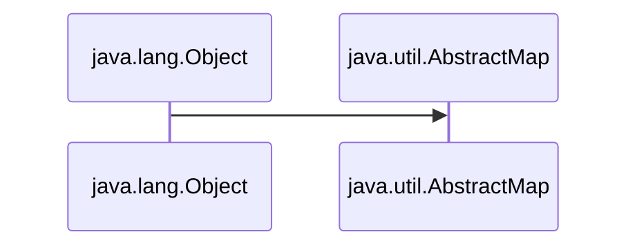
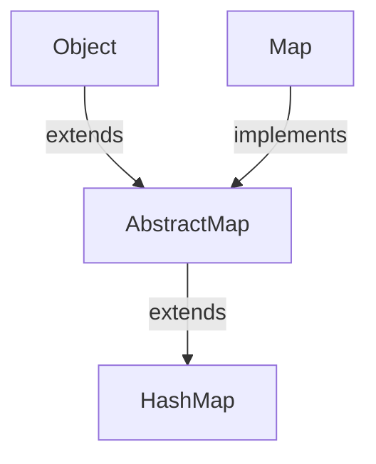
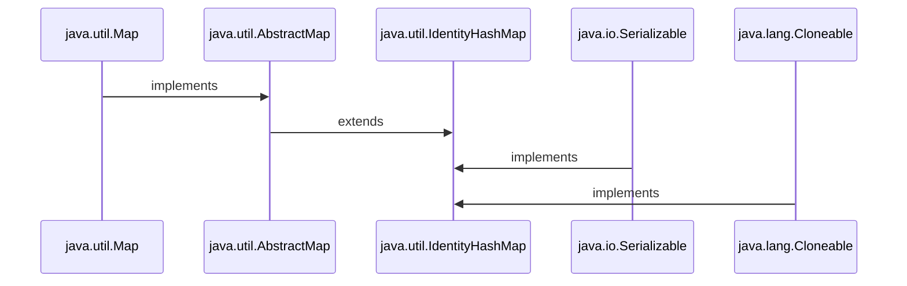
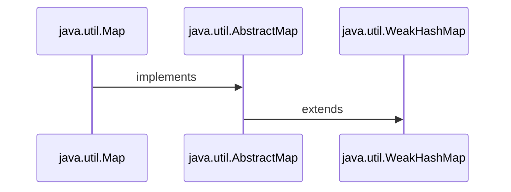

# JavaUtilMap
Here is all about Map of Java

<h1>1. AbstractMap </h1>
<ul>
<li> <h3> 1. Every class of Java is inherited  from <i> java.lang.Object </i>  </h3></li>
<li> <h3> 2. The <i> AbstractMap </i> class is the base class of the map classes in Java.</h3></li>




<li> <h3> 3. The <i>AbstractMap</i> class is a part of the Java Collection Framework.</h3></li>
<li> <h3> 4.  It directly implements the <i>Map</i> interface to provide a structure to it.</h3></li>
<li> <h3> 5.  <i>AbstractMap</i> is an abstract class, hence we cannot create <i>AbstractMap</i>'s Object but the concrete classes that inherit from <i>AbstractMap</i> can be used to create objects .</h3></li>

<br>

<table>
 <tr>
    <th>Interface</th>
    <th>Hash Table</th>
    <th>Resizable Array</th> 
   <th>Balanced Tree</th> 
   <th>Linked List</th> 
</tr> 
<tr>
  <td >Map</td>
  <td >HashMap</td> 
  <td ></td> 
  <td >TreeMap</td>
  <td ></td>
</tr>
<tr>
  <td >SortedMap</td>
  <td ></td> 
  <td ></td> 
  <td >TreeMap</td>
  <td ></td>
</tr>
<tr>
  <td >NavigableMap</td>
  <td ></td> 
  <td ></td> 
  <td >TreeMap</td>
  <td ></td>
</tr>
<tr>
  <td colspan="5">Map.Entry(Inner Class of Map)</td>
 
</tr>
</table>

<h3 align="center">

```Syntax

public abstract class AbstractMap<K,V> extends Object, implements Map<K,V>

```

</h3>

</ul>

<h1>2. Map Interface </h1>

<ul>
<li><h3>1. A <i> map</i> stores data in Key/Value pairs much like an array.</h3></li>
<li><h3>2. Every Key/Value pairs stored in indexes .</h3></li>
<li><h3>3. Every Key/Value pairs are stored as <i>Objects</i> in Java.</h3></li>
<li><h3>4. Typically , <i>keys</i> are Strings.</h3></li>
<li><h3>5. Given a Key and a Value, we can store the value in a <i>Map</i> object.</h3></li>
<li><h3>6. After the value is stored , we can retrieve it by using its Key.</h3></li>
<li><h3>7. Map is generic and is declared : </h3></li>

<h3 align="center">

```Syntax

interface Map<K,V>

```

</h3>


<h3> Where, <i>K</i> specifies the type of keys and <i>V</i> specifies the type of values. </h3>

<li><h3>8. Map do not implement the <i>Iterable</i> interface. Futhermore <i>Iterator</i> also cannot be obtained by a map.</h3></li>

<ul>

```Syntax

That is :

import java.util.Iterator;
import  java.lang.Iterable;

Iterable<Map<Key, Value>> itr = map; → Cannot be Obtained

Or

Iterator<Map<Key, Value>> iterator = map.iterator(); → Cannot be Obtained

```
</ul>

<table>
 <tr>
    <th>Interface</th>
    <th>Description</th>
    
   
</tr> 
<tr>
  <td >Map</td>
  <td >Maps unique keys to values.</td> 
</tr>
<tr>
  <td >Map.Entry</td>
  <td >Describes an element (a key/value) in a map. This is an inner class of Map.</td> 
  
</tr>
<tr>
  <td >NavigableMap</td>
  <td >It extends SortedMap to handle the retrieval of entries based on closest-match searches.</td> 
</tr>
<tr>
  <td >SortedMap</td>
  <td >It extends Map to keep the keys in ascending order.</td> 
</tr>
</table>
</ul>


<h1> 3. HashMap </h1>

<ul>

<h3>1. HashMap extends Abstract Map abstract class. </h3>
<h3>2. As Abstract Map implements Map interface and extends java.lang.Object class , HashMap inherits all of their functions. </h3>
<li> <h3> 3. And most imported thing : "The HashMap provides us an unsorted, unordered Map ".</h3></li>
<li> <h3> 4. HashMap has implementation based on a Hash table.</h3></li>
<li> <h3> 5. Duplicate keys are not allowed i.e. Keys are unique .</h3></li>
<li> <h3> 6. Whereas, Duplicate values can be present / allowed .</h3></li>



<h2> </h2>

<h2 align="Center">Constructors of HashMap </h2>

<ul>

<h3> <a href="https://github.com/AvinandanBose/JavaUtilMap/blob/main/map1.java"> 1.HashMap() </h3>

<h3> <a href="https://github.com/AvinandanBose/JavaUtilMap/blob/main/map2.java"> 2.HashMap(int initialCapacity) </h3>

<h3> <a href="https://github.com/AvinandanBose/JavaUtilMap/blob/main/map3.java"> 3.HashMap(int initialCapacity, float loadFactor) </h3>

<h3> <a href="https://github.com/AvinandanBose/JavaUtilMap/blob/main/map3.java"> 4.HashMap(Map<? extends K, ? extends V> m) </h3>

<table>
 <tr>
    <th>Constructor</th>
    <th>Does This</th>
    
   
</tr> 
<tr>
  <td >HashMap()</td>
  <td >It constructs a new empty map.</td> 
</tr>
<tr>
  <td >HashMap(int initialCapacity)</td>
  <td >It constructs a new empty map, with the given initial capacity.</td> 
  
</tr>
<tr>
  <td >HashMap(int initialCapacity, float loadFactor)</td>
  <td >It constructs a new empty map, with the given initial capacity and  the given load factor.</td> 
</tr>
<tr>
  <td >HashMap(Map<? extends K, ? extends V> m)</td>
  <td >It constructs a new  map, with the same mappings as the given map.</td> 
</tr>
</table>

</ul>

```Syntax

:ThresHold of HashMap, Capacity and LoadFactor:
--------------------------------------------------

ThresHold of HashMap : 
The threshold of a HashMap is approximately the product of current capacity and load factor

LoadFactor : 
The load factor is the measure that decides when to increase the capacity of the Map.

Capacity of HashMap: 
Capacity is the number of buckets in the HashMap. 

Default Capacity of HashMap: 16
That is empty HashMap created with capacity 16.

Default LoadFactor of HashMap: 0.75
That is empty HashMap created with Load Factor 0.75.

Default Threshold of HashMap: is 16 * 0.75 = 12.
That is empty HashMap created with threshold 12.

```


<h3> <i> Extras: </i> </h3>

```Syntax

Index: 
It is the integer value .
It is obtained after performing → 
Bitwise AND operation on the Value of Hash of the Key and Array Size Minus One.

i.e., :| Index = hashcode(key) & (ArraySize – 1) |:


Bucket: It is a LinkedList structure of nodes.


Node: It is the elementary unit of a HashMap. 
It contains the key-value pair and a link to the next node.

Next: Link to the next node.

It is represented as:  Node<K,V> next.

Where K represents Key and V represents Value.

Rehashing: It is the process of doubling the capacity of the HashMap ,
after it reaches its Threshold. In java, HashMap continues to 
rehash(by default) in the following sequence – 2^4, 2^5, 2^6, 2^7, …. so on. 


```


<h2> </h2>

<h2 align="Center">Methods of HashMap </h2>

<ul>
<h3> <a href="https://github.com/AvinandanBose/JavaUtilMap/blob/main/mapmethods1.java"> 1.Clear </h3>

```Syntax

It removes all the mappings of this map.
The map will be empty after this call returns.

```

<h3> <a href="https://github.com/AvinandanBose/JavaUtilMap/blob/main/mapmethods2.java"> 2.Clone </h3>

```Syntax
Returns a shallow copy of the HashMap instance provided for cloning
but the keys and values themselves are not cloned.

```


<h3> <a href="https://github.com/AvinandanBose/JavaUtilMap/blob/main/mapmethods3.java"> 3.containsKey </h3>

```Syntax
Returns true if this map contains a mapping for the specified key.

```

<h3> <a href="https://github.com/AvinandanBose/JavaUtilMap/blob/main/mapmethods4.java"> 4.containsValue </h3>

```Syntax
Returns true if this map maps one or more keys to the specified value.

```

<h3> <a href="https://github.com/AvinandanBose/JavaUtilMap/blob/main/mapmethods5.java"> 5.forEach </h3>

```Syntax
Performs the given action for each entry in this map 
until all entries have been processed or the action throws an exception.

```


<h3> <a href="https://github.com/AvinandanBose/JavaUtilMap/blob/main/mapmethods6.java"> 6.get </h3>
  
```Syntax

Syntax: get(key: Key)

Returns the value to which the specified key is mapped, 
or null if this map contains no mapping for the key.

```

<h3> <a href="https://github.com/AvinandanBose/JavaUtilMap/blob/main/mapmethods7.java"> 7.getOrDefault</h3>

```Syntax

Syntax: getOrDefault(key: Key , defaultValue:Value)

Returns the value to which the specified key is mapped, 
or defaultValue if this map contains no mapping for the key.

i.e.,getOrDefault(key:"One" , defaultValue:1)
then it will return the value for the key : "One"
Or, it will return the value for the value : 1

Most priority given or first search is Key for Value .
If not found , then it searches for defaultValue for value.

That is if "One" is not found then it searches for 1.
```

<h3> <a href="https://github.com/AvinandanBose/JavaUtilMap/blob/main/mapmethods8.java"> 8.isEmpty</h3>

```Syntax

Returns true if this map contains no key-value mappings.
```

<h3> <a href="https://github.com/AvinandanBose/JavaUtilMap/blob/main/mapmethods9.java"> 9.KeySet</h3>

```Syntax

Returns a Set view of the keys contained in this map. 
The set is backed by the map, 
so changes to the map are reflected in the set, and vice-versa.

Note:
As Set<K> keySet()→ Is a Function that returns Set,
Hence, it call all those functions that Set contains,
Such as:
→forEach
→toArray()
→remove()
→removeIf()
→retainAll()
→removeAll()
→Stream()
→ParallelStream()
→spliterator()
→iterator()
→contains()
→containsAll()
...etc.

It does not support the add or addAll operations.
```


<h3> <a href="https://github.com/AvinandanBose/JavaUtilMap/blob/main/mapmethods10.java"> 10.Put</h3>

```Syntax

Associates the specified value with the specified key in this map. 
If the map previously contained a mapping for the key, 
the old value is replaced.
```

<h3> <a href="https://github.com/AvinandanBose/JavaUtilMap/blob/main/mapmethods11.java"> 11.PutAll</h3>

```Syntax

Copies all of the mappings from the specified map to this map. 
These mappings will replace any mappings that this map had ,
for any of the keys currently in the specified map.
```

<h3> <a href="https://github.com/AvinandanBose/JavaUtilMap/blob/main/mapmethods12.java"> 12.Remove(key: Key)</h3>

```Syntax
Removes the mapping for the specified key from this map if present.
```

<h3> <a href="https://github.com/AvinandanBose/JavaUtilMap/blob/main/mapmethods13.java"> 13.Remove(key: Key, value:Value)</h3>

```Syntax
Removes the entry for the specified key only if it is currently mapped to the specified value.
```

<h3> <a href="https://github.com/AvinandanBose/JavaUtilMap/blob/main/mapmethods14.java"> 14.Replace(key: Key, oldValue:Value, newValue:Value)</h3>

```Syntax
Replaces the entry for the specified key only if currently mapped to the specified value.
It replaces old value with new value.
```

<h3> <a href="https://github.com/AvinandanBose/JavaUtilMap/blob/main/mapmethods15.java"> 15.ReplaceAll(BiFunction function)</h3>

```Syntax
Replaces each entry's value with the result of invoking the given function,
on that entry until all entries have been processed or 
the function throws an exception.
```

<h3> <a href="https://github.com/AvinandanBose/JavaUtilMap/blob/main/mapmethods16.java"> 16.Size()</h3>

```Syntax
Returns the number of key-value mappings in this map.
```

<h3> <a href="https://github.com/AvinandanBose/JavaUtilMap/blob/main/mapmethods17.java"> 17.values()</h3>

```Syntax
Returns a Collection view of the values contained in this map.

Note:
Iterator.remove
Iterator.hasNext()
Iterator.next()
Collection.remove, 
Collection.removeAll, 
Collection.removeIf,
Collection.retainAll and 
Collection.clear 

like selected operations is performed,
as it returns a Collection.

Except:

It does not support the add or addAll operations.
```

<h3> <a href="https://github.com/AvinandanBose/JavaUtilMap/blob/main/mapmethods18.java"> 18.putIfAbsent()</h3>

```Syntax
If the specified key is not already associated with a value ,
then associates it with the given value .

If the specified key is not already associated with a value,
and now the new value mapped with the new key is NULL , 
then it will return null. 
```
<h3> <a href="https://github.com/AvinandanBose/JavaUtilMap/blob/main/mapmethods19.java"> 19.compute(key:Key,BiFunction function)</h3>


```Syntax
Attempts to compute a mapping for the specified key and 
its current mapped value (or null if there is no current mapping).
```

<h3> <a href="https://github.com/AvinandanBose/JavaUtilMap/blob/main/mapmethods20.java"> 20.computeIfAbsent(key:Key, MappingFunction function)</h3>


```Syntax
If the specified key is not already associated with a value 
(or is mapped to null), attempts to compute its value,
using the given mapping function and
enters it into this map unless null.

If the mapping function returns null, no mapping is recorded.
```

<h3> <a href="https://github.com/AvinandanBose/JavaUtilMap/blob/main/mapmethods21.java"> 21.computeIfPresent(key:Key, BiFunction function)</h3>


```Syntax
If the value for the specified key is present and non-null, 
attempts to compute a new mapping given the key 
and its current mapped value.

If the remapping function returns null, the mapping is removed.
```


<h3> <a href="https://github.com/AvinandanBose/JavaUtilMap/blob/main/mapmethods22.java"> 22.entrySet()</h3>


```Syntax
Returns a Set view of the mappings contained in this map. 
The set is backed by the map, 
so changes to the map are reflected in the set, 
and vice-versa. 


As entrySet()→ Is a Function that returns Set,
Hence, it call all those functions that Set contains,
Such as:
→forEach
→toArray()
→remove()
→removeIf()
→retainAll()
→removeAll()
→Stream()
→ParallelStream()
→spliterator()
→iterator()
→contains()
→containsAll()
...etc.

It does not support the add or addAll operations.
```

<h3> <a href="https://github.com/AvinandanBose/JavaUtilMap/blob/main/mapmethods23.java"> 22.merge(key:Key, value:Value, BiFunction remappingFunction)</h3>


```Syntax
If the specified key is not already associated with a value
or is associated with null, associates it with the given non-null value. 
Otherwise, replaces the associated value with the results of the given remapping function, 
or removes if the result is null. 

This method may be of use when combining multiple mapped values for a key.
```

<h3> <a href="https://github.com/AvinandanBose/JavaUtilMap/blob/main/mapmethods24.java"> 24.Replace(key: Key, value:Value)</h3>

```Syntax
Replaces the entry for the specified key only if it is currently mapped to some value.
```

<table>
 <tr>
    <th>Methods</th>
    <th>Does This</th>
    
   
</tr> 
<tr>
  <td >1. Clear</td>
  <td >It removes all of the mappings from the map.</td> 
</tr>
<tr>
  <td >2.Clone</td>
  <td >It gets a copy of this HashMap instance</td> 
  
</tr>
<tr>
  <td >3.containsKey</td>
  <td >Returns true if this map contains a mapping for the specified key.</td> 
</tr>
<tr>
  <td >4.containsValue</td>
  <td >Returns true if this map maps one or more keys to the specified value.</td> 
</tr>

<tr>
  <td >5.forEach</td>
  <td >Performs the given action for each entry in this map 
until all entries have been processed or the action throws an exception.</td> 
</tr>

<tr>
  <td >6.get(key: Key)</td>
  <td >Returns the value to which the specified key is mapped, 
or null if this map contains no mapping for the key.</td> 
</tr>


<tr>
  <td >7.getOrDefault(key: Key , defaultValue:Value)</td>
  <td >Returns the value to which the specified key is mapped, 
or defaultValue if this map contains no mapping for the key.</td> 
</tr>


<tr>
  <td >8.isEmpty</td>
  <td >Returns true if this map contains no key-value mappings.</td> 
</tr>

<tr>
  <td >9.KeySet</td>
  <td >Returns a Set view of the keys contained in this map. 
The set is backed by the map, 
so changes to the map are reflected in the set, and vice-versa.If the map is modified while an iteration over the set is in progress (except through the iterator's own remove operation), the results of the iteration are undefined. The set supports element removal, which removes the corresponding mapping from the map, via the Iterator.remove, Set.remove, removeAll, retainAll, and clear operations.
It does not support the add or addAll operations.
</td> 
</tr>

<tr>
  <td >10.Put</td>
  <td >Associates the specified value with the specified key in this map. 
If the map previously contained a mapping for the key, 
the old value is replaced.</td> 
</tr>

<tr>
  <td >11.PutAll</td>
  <td > Copies all of the mappings from the specified map to this map. 
These mappings will replace any mappings that this map had ,
for any of the keys currently in the specified map.</td> 
</tr>

<tr>
  <td >12.Remove(key: Key)</td>
  <td > Removes the mapping for the specified key from this map if present.</td> 
</tr>

<tr>
  <td >13.Remove(key: Key, value:Value)</td>
  <td > Removes the entry for the specified key only if it is currently mapped to the specified value.
</td> 

<tr>
  <td >14.Replace(key: Key, oldValue:Value, newValue:Value)</td>
  <td > Replaces the entry for the specified key only if currently mapped to the specified value.
It replaces old value with new value.
</td>
</tr>

<tr>
  <td >15.ReplaceAll(BiFunction function)</td>
  <td > Replaces each entry's value with the result of invoking the given function,
on that entry until all entries have been processed or 
the function throws an exception.
</td>
</tr>

<tr>
  <td >16.Size()</td>
  <td > Returns the number of key-value mappings in this map.
</td>
</tr>

<tr>
  <td >17.values()</td>
  <td > Returns a Collection view of the values contained in this map.
</td>
</tr>

<tr>
  <td >18.putIfAbsent()</td>
  <td > If the specified key is not already associated with a value ,
then associates it with the given value .
</td>
</tr>

<tr>
  <td >19.compute(key:Key,BiFunction function)</td>
  <td > Attempts to compute a mapping for the specified key and 
its current mapped value (or null if there is no current mapping).
</td>
</tr>

<tr>
  <td >20.computeIfAbsent(key:Key, MappingFunction function)</td>
  <td > If the specified key is not already associated with a value 
(or is mapped to null), attempts to compute its value,
using the given mapping function and
enters it into this map unless null.

If the mapping function returns null, no mapping is recorded.
</td>
</tr>

<tr>
  <td >21.computeIfPresent(key:Key, BiFunction function)</td>
  <td >If the value for the specified key is present and non-null, 
attempts to compute a new mapping given the key 
and its current mapped value.

If the remapping function returns null, the mapping is removed.
</td>
</tr>

<tr>
  <td >22.entrySet()</td>
  <td >Returns a Set view of the mappings contained in this map. 
The set is backed by the map, 
so changes to the map are reflected in the set, 
and vice-versa. If the map is modified while an iteration over the set is in progress (except through the iterator's own remove operation, or through the setValue operation on a map entry returned by the iterator) the results of the iteration are undefined. The set supports element removal, which removes the corresponding mapping from the map, via the Iterator.remove, Set.remove, removeAll, retainAll and clear operations.It does not support the add or addAll operations.
</td>
</tr>

<tr>
  <td >23.merge(key:Key, value:Value, BiFunction remappingFunction)</td>
  <td >If the specified key is not already associated with a value
or is associated with null, associates it with the given non-null value. 
Otherwise, replaces the associated value with the results of the given remapping function, 
or removes if the result is null. 

This method may be of use when combining multiple mapped values for a key.
</td>
</tr>

<tr>
  <td >24.Replace(key:Key, value:Value)</td>
  <td >Replaces the entry for the specified key only if it is currently mapped to some value.
</td>
</tr>

</table>
</ul>
<h2 align="Center">Methods inherited from class java.util.AbstractMap </h2>
<ul>

<h3> <a href="https://github.com/AvinandanBose/JavaUtilMap/blob/main/AbstractMapMethods1.java"> 1.equals()</h3>

```Syntax
Compares the specified object with this map for equality. 
Returns true if the given object is also a map and the two maps represent the same mappings. 

More formally, two maps m1 and m2 represent the same mappings,
if m1.entrySet().equals(m2.entrySet()).
```

<h3> <a href="https://github.com/AvinandanBose/JavaUtilMap/blob/main/AbstractMapMethods2.java"> 2.toString()</h3>

```Syntax
Returns a string representation of this map. 
```

<h3> <a href="https://github.com/AvinandanBose/JavaUtilMap/blob/main/AbstractMapMethods3.java"> 3.hashCode()</h3>

```Syntax
Returns the hash code value for this map. 
```

<table>
 <tr>
    <th>Methods</th>
    <th>Does This</th>
    
   
</tr> 

<tr>
  <td >1.equals()</td>
  <td >Compares the specified object with this map for equality. 
Returns true if the given object is also a map and the two maps represent the same mappings. 
</td>
</tr>

<tr>
  <td >toString()</td>
  <td >Returns a string representation of this map. 
</td>
</tr>

<tr>
  <td >hashCode()</td>
  <td >Returns the hash code value for this map. 
</td>
</tr>
</table>
</ul>
<h3><i><ins>Note:</ins></i> Map interface →java.util.Map contains: equals(), forEach(), getOrDefault(), hashCode(), putIfAbsent(), remove(), replace(), replaceAll() 
functions inherited by HashMap() have same actions in program . </h3>
</ul>

<h1> </h1>
<h1 align="Center"> Division of Abstract Map </h1>

<ul>

```mermaid
 
 graph TD;
    Map-->|implements| AbstractMap;
    AbstractMap-->|extends| HashMap;
    AbstractMap-->|extends| IdentityHashMap;
    AbstractMap-->|extends| WeakHashMap;
    AbstractMap-->|extends| TreeMap;
    AbstractMap-->|extends| EnumMap;
    AbstractMap-->|extends| ConcurrentHashMap;
    AbstractMap-->|extends| ConcurrentSkipListMap;
    HashMap-->|extends| LinkedHashMap; 
 ```
 </ul> 
 
<h1> </h1>

<h1 align="Center"> Linked Hash Map </h1>

<ul>

```mermaid

sequenceDiagram
    
  
  java.util.Map->>java.util.HashMap:implements 
  java.util.HashMap->>java.util.LinkedHashMap:extends
  
  
```

<li> <h3> 1. A LinkedHashMap is an extension of the HashMap class and it implements the Map interface. </h3> </li>

<h3 align="Center">

```Syntax

public class LinkedHashMap<K,​V> extends HashMap<K,​V> implements Map<K,​V>

```

</h3>

<li> <h3> 2.The implementation of the LinkedHashMap is very similar to a doubly-linked list. Therefore, each node of the LinkedHashMap is represented as: </h3> </li>


<ul>
<li> <h3><ins><i>Hash</i></ins>: All the input keys are converted into a hash which is a shorter form of the key so that the search and insertion are faster.</h3> </li>
<li> <h3><ins><i>Key</i></ins>: Since this class extends HashMap, the data is stored in the form of a key-value pair. Therefore, this parameter is the key to the data.</h3> </li>
<li> <h3><ins><i>Value</i></ins>: For every key, there is a value associated with it. This parameter stores the value of the keys. Due to generics, this value can be of any form.</h3> </li>
<li> <h3><ins><i>Next</i></ins>: Since the LinkedHashMap stores the insertion order, this contains the address to the next node of the LinkedHashMap.</h3> </li>
<li> <h3><ins><i>Previous</i></ins>: This parameter contains the address to the previous node of the LinkedHashMap.</h3> </li>

</ul>

<li> <h3> 3.The implementation of LinkedHashMap is not synchronized. </h3> </li>
<li> <h3> 4.It contains only unique elements.</h3> </li>
<li> <h3> 5.It may have one null key and multiple null values.</h3> </li>
<li> <h3> 6.It is the same as HashMap with an additional feature that it maintains insertion order. For example, when we run the code with a HashMap, we get a different order of elements.</h3> </li>
 <h3 align="Center"> <i>That is, It first take elements according to their hash, </i></h3> 
<h3 align="Center"> <i> Then if any insertion occurs it inserts them as (doubly)linked list.</i></h3> 

<h2> </h2>
<h2 align="Center">Constructors of LinkedHashMap </h2>
<ul>
<li><h3> <a href="https://github.com/AvinandanBose/JavaUtilMap/blob/main/constructLinkedHashMap.java"> 1.LinkedHashMap()</h3></li>

```Syntax

It is used to construct a default LinkedHashMap.

Constructs an empty insertion-ordered LinkedHashMap instance ,
with the default initial capacity (16) and load factor (0.75).
    
```
<li><h3> <a href="https://github.com/AvinandanBose/JavaUtilMap/blob/main/constructLinkedHashMap1.java"> 2.LinkedHashMap(int capacity)</h3></li>

```Syntax

It is used to initialize a LinkedHashMap with the given capacity.

Constructs an empty insertion-ordered LinkedHashMap instance ,
with the specified initial capacity and a default load factor (0.75).
    
```

<li><h3> <a href="https://github.com/AvinandanBose/JavaUtilMap/blob/main/constructLinkedHashMap2.java"> 3.LinkedHashMap(int capacity, float loadFactor)</h3></li>

```Syntax

It is used to initialize both the capacity and the load factor.

Constructs an empty insertion-ordered LinkedHashMap instance,
with the specified initial capacity and load factor.
    
```
<li><h3> <a href="https://github.com/AvinandanBose/JavaUtilMap/blob/main/constructLinkedHashMap3.java"> 4.LinkedHashMap(int capacity, float loadFactor, boolean accessOrder)</h3></li>

```Syntax

It is used to initialize both the capacity and the load factor with specified ordering mode.

Constructs an empty LinkedHashMap instance ,
with the specified initial capacity, load factor and ordering mode.
    
```

<li><h3> <a href="https://github.com/AvinandanBose/JavaUtilMap/blob/main/constructLinkedHashMap4.java"> 5.LinkedHashMap(Map<? extends K,? extends V> m)</h3></li>

```Syntax

It is used to initialize the LinkedHashMap with the elements from the given Map class m.

Constructs an insertion-ordered LinkedHashMap instance ,
with the same mappings as the specified map. 
The LinkedHashMap instance is created with a default load factor (0.75) 
and an initial capacity sufficient to hold the mappings in the specified map.
    
```

<table>
 <tr>
    <th>Constructor</th>
    <th>Description</th>
       
</tr> 

<tr>
  <td >LinkedHashMap()</td>
  <td >It is used to construct a default LinkedHashMap. Constructs an empty insertion-ordered LinkedHashMap instance ,
with the default initial capacity (16) and load factor (0.75).</td>
</tr>


<tr>
  <td >LinkedHashMap(int capacity)</td>
  <td >It is used to initialize a LinkedHashMap with the given capacity.Constructs an empty insertion-ordered LinkedHashMap instance ,
with the specified initial capacity and a default load factor (0.75).</td>
</tr>

<tr>
  <td >LinkedHashMap(int capacity, float loadFactor)</td>
  <td >It is used to initialize both the capacity and the load factor.Constructs an empty insertion-ordered LinkedHashMap instance,
with the specified initial capacity and load factor.</td>
</tr>

<tr>
  <td >LinkedHashMap(int capacity, float loadFactor, boolean accessOrder)</td>
  <td >It is used to initialize both the capacity and the load factor with specified ordering mode.Constructs an empty LinkedHashMap instance ,
with the specified initial capacity, load factor and ordering mode.</td>
</tr>

<tr>
  <td >LinkedHashMap(Map<? extends K,? extends V> m)</td>
  <td >It is used to initialize the LinkedHashMap with the elements from the given Map class m.Constructs an insertion-ordered LinkedHashMap instance ,
with the same mappings as the specified map. 
The LinkedHashMap instance is created with a default load factor (0.75) 
and an initial capacity sufficient to hold the mappings in the specified map.</td>
</tr>

</table>


</ul>


<h2> </h2>
<h2 align="Center">Methods of LinkedHashMap </h2>
<ul>
<li><h3> <a href="https://github.com/AvinandanBose/JavaUtilMap/blob/main/LinkedHashMap1.java"> 1. All HashMap and AbstractMap Functions in LinkedHashMap</h3></li>

<h3> New Method : </h3>
<table>
 <tr>
    <th>Methods</th>
    <th>Does This</th>
    
   
</tr> 

<tr>
  <td >removeEldestEntry()</td>
  <td >It is used keep a track of whether the map removes any eldest entry from the map. So each time a new element is added to the LinkedHashMap, the eldest entry is removed from the map. This method is generally invoked after the addition of the elements into the map by the use of put() and putall() method.
</td>
</tr>

</table>
<li><h3> <a href="https://github.com/AvinandanBose/JavaUtilMap/blob/main/LinkedHashMap2.java"> 2. removeEldestEntry()</h3></li>

```Syntax

It is used keep a track of whether the map removes any eldest entry from the map. 
So each time a new element is added to the LinkedHashMap, the eldest entry is removed from the map. 
This method is generally invoked after the addition of the elements into the map,
by the use of put() and putall() method.

Eg:

If Map = {a=1, b=2, c=3, d=4, e=5, f=6, g=7, h=8, i=9, j=10}

Then, removeEldestEntry :
Size < 1 or Size ==0  → {a=1, b=2, c=3, d=4, e=5, f=6, g=7, h=8, i=9, j=10}
Size > 1 = {j=10}
Size > 2 = {i=9, j=10}
Size > 3 = {h=8, i=9, j=10}
..... etc.
```
</ul>
</ul>

<h2> </h2>
<h2 align="Center">Synchronization of LinkedHashMap </h2>
<ul>
<li> <h3> 1.The implementation of LinkedHashMap is not synchronized. </h3> </li>
<li> <h3>2.If multiple threads access a linked hash map concurrently, and at least one of the threads modifies the map structurally, it must be synchronized externally.This is typically accomplished by synchronizing on some object that naturally encapsulates the map. </h3> </li>
<li> <h3>3. If no such object exists, the map should be “wrapped” using the <i>Collections.synchronizedMap </i> method  . This is best done at creation time, to prevent accidental unsynchronized access to the map. </h3> </li>

<ul>
<li><h3> <a href="https://github.com/AvinandanBose/JavaUtilMap/blob/main/synchronizedLinkedHashMap.java"> Synchronized Linked HashMap</h3></li>
</ul>

</ul>

<h1> </h1>
<h1 align="Center"> Identity Hash Map </h1>

<ul>



<li> <h3> 1. A IdentityHashMap is an extension of the AbstractMap class and it implements the Map interface. </h3> </li>
<li> <h3> 2. It is not synchronized and must be synchronized externally. </h3> </li>
<li> <h3> 3. It uses reference equality rather than using the equals() method. It uses the == operator. </h3> </li>
<li> <h3> 4. Iterators are fail-fast, throw ConcurrentModificationException in an attempt to modify while iterating.ConcurrentModificationException exception may be thrown by methods that have detected concurrent modification of an object when such modification is not permissible.</h3> </li>

<h3 align="Center">

```Syntax

public class IdentityHashMap<K,​V> extends AbstractMap<K,​V> implements Map<K,​V> 
,Serializable, Cloneable 

```
</h3>
<h2></h2>
<h2 align="Center">Constructors of IdentityHashMap </h2>
<ul>

<li><h3> <a href="https://github.com/AvinandanBose/JavaUtilMap/blob/main/constructIdentityHashMap.java"> 1.IdentityHashMap()</h3></li>

```Syntax
Constructs a new, empty identity hash map with a default expected maximum size (21).
    
```

<li><h3> <a href="https://github.com/AvinandanBose/JavaUtilMap/blob/main/constructIdentityHashMap1.java"> 2.IdentityHashMap(int ExpectedMaxSize)</h3></li>

```Syntax
It creates a new and empty identity hash map with the given specified expected maximum size.

Constructs a new, empty map with the specified expected maximum size. 
Putting more than the expected number of key-value mappings into the map ,
may cause the internal data structure to grow, which may be somewhat time-consuming.
    
```

<li><h3> <a href="https://github.com/AvinandanBose/JavaUtilMap/blob/main/constructIdentityHashMap2.java"> 3.IdentityHashMap(Map m)</h3></li>

```Syntax
It creates a new identity hash map with the key-value pairs given in the specified map.

Constructs a new identity hash map containing the keys-value mappings in the specified map.
    
```

<table>
 <tr>
    <th>Constructor</th>
    <th>Does This</th>
    
   
</tr> 

<tr>
  <td >IdentityHashMap()</td>
  <td >Constructs a new, empty identity hash map with a default expected maximum size (21).</td>
</tr>
<tr>
  <td >IdentityHashMap(int ExpectedMaxSize)</td>
  <td >It creates a new and empty identity hash map with the given specified expected maximum size.
Constructs a new, empty map with the specified expected maximum size. 
Putting more than the expected number of key-value mappings into the map ,
may cause the internal data structure to grow, which may be somewhat time-consuming.</td>
</tr>

<tr>
  <td >IdentityHashMap(Map m)</td>
  <td >It creates a new identity hash map with the key-value pairs given in the specified map.

Constructs a new identity hash map containing the keys-value mappings in the specified map.</td>
</tr>

</table>

</ul>
<h2></h2>
<h2 align="Center">Methods of IdentityHashMap </h2>
<ul>
<li><h3> <a href="https://github.com/AvinandanBose/JavaUtilMap/blob/main/IdentityHashMap1.java"> 1. All HashMap and AbstractMap Functions in IdentityHashMap</h3></li>
<li><h3> 2. Difference between HashMap and Identity HashMap.</h3></li>
<ul>
<li><h3> <a href="https://github.com/AvinandanBose/JavaUtilMap/blob/main/IdentityHashMap2.java">  Difference between HashMap and Identity HashMap</h3></li>

```Syntax

For Hash Map:

map.put("a", 1);

a is a String constant and 1 is Integer constant.

map.put(new String("a"), 2);

Here a is an object of String and 2 is an Integer constant.

But in HashMap it check key as :

map.put("a", 1).equals(map.put(new String("a"), 1));

i.e., it treats constant and object is equal as Keys are same i.e. "a".

i.e. "a".equals("a")

Which returns true , where as:

For Identity Hash Map:

map1.put("a", 1).equals(map1.put(new String("a"), 1))

Here it treats constant and object are different i.e.

"a" not equal to {new String("a")}

i.e. it uses:

"a" == {new String("a")} which is false

Hence it creates : {a=1,a=1} map


Now in Identity Hash Map: 

 map1.put("a", 2); will update,
 1st Key which have String constant ,
 
 i.e. : {a=2,a=1}
 
map1.put(new String("a"), 2); will update,
2nd Key which have String object ,

 i.e. : {a=2,a=2}
 
 While for HashMap:
 map.put("a", 1);
 = {a=1}
 map.put(new String("a"),2}
 =  {a=2}
 map.put("a",3}
 =  {a=3}
 
 .... etc
 
 This is the differnce between Hash Map and Identity Map.
```
</ul>
</ul>
<h2></h2>
<h2 align="Center">Synchronized IdentityHashMap </h2>
<ul>
<h3>
When more than one threads access the identity hash map concurrently, and at least one of the threads structurally modifies the map, it is necessary to synchronize that map externally. (Structural modification of map is to add or delete one or more key value mappings. If we just change the value associated with a key that an instance contains already is not structural modification.)
</h3>

<h3>
It can be achieved by synchronizing on any object that encapsulate the map. If such object doesn't exist, map should be wrapped with the help of Collections.synchronizedMap() method. The correct time to do this is at the time of creation, in order to prevent unsynchronized access to map.
</h3>
<ul>
<li><h3> <a href="https://github.com/AvinandanBose/JavaUtilMap/blob/main/synchronizedIdentityHashMap.java"> Synchronized Identity HashMap</h3></li>
</ul>

</ul>
</ul>

<h1></h1>
<h1 align="Center">Weak Hash Map </h1>

<ul>



<h3 align="Center">

```Syntax

public class WeakHashMap<K,V> extends AbstractMap<K,V> implements Map<K,V>

```

</h3>

<li><h3>1. <i><ins>WeakHashMap</ins></i> is an implementation of the Map interface, that stores only weak references to its keys. </h3></li>
<li><h3>2. Storing only weak references allows a key-value pair to be garbage-collected when its key is no longer referenced outside of the WeakHashMap. </h3></li>
<li><h3>3. <i><ins>WeakHashMap</ins></i>  does not implement <i><ins>Cloneable interface</ins></i>, hence it doesnot have <i><ins>clone()</ins></i> functionality. </h3></li>

<li><h3>4. If object is specified as key doesn’t contain any references- it is eligible for <i><ins>Garbage Collection</ins></i> even though it is associated with <i><ins>WeakHashMap</ins></i>. i.e. <i><ins>Garbage Collector</ins></i> dominates over <i><ins>WeakHashMap</ins></i>. </h3></li>


<li><h3>5. In <i><ins>WeakHashmap</ins></i>, When a key is discarded then its entry is automatically removed from the map, in other words, garbage collected. </h3></li>

<h2> </h2>
<h2 align="Center"> <i>WeakReference Vs Strong Reference[on Reference to Hash Map and Weak Map]</i> </h2>
<ul>
<h3><i>1.Strong Reference:</i></h3>

```Syntax

public class example {
    public static void main(String[] args) {
        example obj = new example();
        obj = null;
        System.gc();
    }
    
    
}

```

<h3><i>Here "obj" object has strong reference to the instance of class "example" .</i></h3>
<h3><i>Hence Not eligible for garbage collection until:</i></h3>


```Syntax

obj = null 

```
<h3><i>i.e. The object is garbage collected only when the variable which was strongly referenced points to null.</i></h3>
<h3><i>As 'obj' object is no longer referencing to the instance of class: "example".</i></h3>
<h3><i><ins>Best example:</ins></i></h3>

```Syntax

class ex{
    public void finalize(){
        System.out.println("Finalize method called");
    }
}
public class example {
    public static void main(String[] args) {
        ex obj = new ex();
        obj.finalize();
        obj = null;
        System.gc();//Garbage Collector
        obj.finalize();//will not call finalize method and throws Null Pointer Exception
    }
    
    
}

```
<ul>
<li><h3> <a href="https://github.com/AvinandanBose/JavaUtilMap/blob/main/StrongRefexample.java"> Strong Reference Example</h3></li>
</ul>
<h3><i><ins>In HashMap, key objects have strong references. </ins></i></h3>

</ul>

<h3><i>2.Weak Reference:</i></h3>
<ul>
<li><h3>1. This type of reference is used in <i><ins>WeakHashMap</ins></i> to reference the entry objects . </h3></li>
<li><h3>2. If JVM detects an object with only weak references (i.e. no strong or soft references linked to any object), this object will be marked for garbage collection. </h3></li>
<li><h3>3. To create such references <i><ins>java.lang.ref.WeakReference</ins></i> class is used. </h3></li>
<li><h3>4. Weak Reference Objects are not the default type/class of Reference Object. They are explicitly specified while using them.</h3></li>

```Syntax

import java.lang.ref.WeakReference;

class exceptions {
    void print() {
        System.out.println("Print method called");
    }
}

public class WeakRefexample {
    public static void main(String[] args) {

        // Strong Reference
        exceptions obj = new exceptions();
        obj.print();

        // Weak Reference has explicit type class[exceptions] of Reference Object[obj]
        WeakReference<exceptions> weak = new WeakReference<>(obj); 

        obj = null;
        exceptions obj1 = weak.get();

        /**
         * 
         * get() function : It returns this reference object's referent.
         * If this reference object has been cleared,
         * either by the program or by the garbage collector,
         * then this method returns null.
         * 
         **/

        obj1.print(); // will call print method and will not throw any exceptions
    }

}

```
<ul>
<li><h3> <a href="https://github.com/AvinandanBose/JavaUtilMap/blob/main/WeakRefexample.java"> Weak Reference Example</h3></li>
</ul>
</ul>
<h2></h2>
<h2 align="Center">Constructors of WeakHashMap </h2>
<ul>

<li><h3> <a href="https://github.com/AvinandanBose/JavaUtilMap/blob/main/constructWeakHashMap.java"> 1.WeakHashMap()</h3></li>

```Syntax

It is used to construct a default constructor of WeakHashMap.

This constructor constructs a new, 
empty WeakHashMap with the default initial capacity (16) 
and the default load factor (0.75).
    
```
<li><h3> <a href="https://github.com/AvinandanBose/JavaUtilMap/blob/main/constructWeakHashMap1.java"> 2.WeakHashMap(int initialCapacity)</h3></li>

```Syntax

This constructor constructs a new, 
empty WeakHashMap with the given 
initial capacity and 
the default load factor, which is 0.75.
    
```

<li><h3> <a href="https://github.com/AvinandanBose/JavaUtilMap/blob/main/constructWeakHashMap2.java"> 3.WeakHashMap(int initialCapacity, float loadFactor)</h3></li>

```Syntax

This constructor constructs a new, empty WeakHashMap 
with the given initial capacity and the given load factor.
    
```

<li><h3> <a href="https://github.com/AvinandanBose/JavaUtilMap/blob/main/constructWeakHashMap3.java"> 4.WeakHashMap(Map m)</h3></li>

```Syntax

This constructor constructs a new WeakHashMap ,
with the same mappings as the specified Map.
    
```

<table>
 <tr>
    <th>Constructor</th>
    <th>Does This</th>
    
   
</tr> 
<tr>
  <td >WeakHashMap()</td>
  <td >It is used to construct a default constructor of WeakHashMap.This constructor constructs a new, 
empty WeakHashMap with the default initial capacity (16) 
and the default load factor (0.75).</td>
</tr>

<tr>
  <td >WeakHashMap(int initialCapacity)</td>
  <td >This constructor constructs a new, 
empty WeakHashMap with the given 
initial capacity and 
the default load factor, which is 0.75.</td>
</tr>


<tr>
  <td >WeakHashMap(int initialCapacity, float loadFactor)</td>
  <td >This constructor constructs a new, empty WeakHashMap 
with the given initial capacity and the given load factor.</td>
</tr>


<tr>
  <td >WeakHashMap(Map m)</td>
  <td >This constructor constructs a new WeakHashMap ,
with the same mappings as the specified Map.</td>
</tr>
</table>
</ul>
<h2></h2>
<h2 align="Center">Methods of WeakHashMap </h2>
<ul>
</ul>
</ul>
