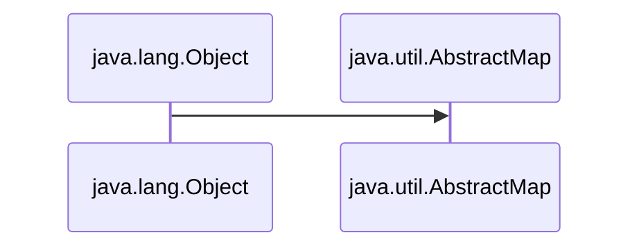

# JavaUtilMap
Here is all about Map of Java

<h1>1. AbstractMap </h1>
<ul>
<li> <h3> 1. Every class of Java is inherited  from <i> java.lang.Object </i>  </h3></li>
<li> <h3> 2. The <i> AbstractMap </i> class is the base class of the map classes in Java.</h3></li>

<li> <h3> 3. The <i>AbstractMap</i> class is a part of the Java Collection Framework.</h3></li>
<li> <h3> 4.  It directly implements the <i>Map</i> interface to provide a structure to it.</h3></li>
<li> <h3> 5.  <i>AbstractMap</i> is an abstract class, hence we cannot create <i>AbstractMap</i>'s Object but the concrete classes that inherit from <i>AbstractMap</i> can be used to create objects .</h3></li>

 

<table>
 <tr>
    <th>Interface</th>
    <th>Hash Table</th>
    <th>Resizable Array</th> 
   <th>Balanced Tree</th> 
   <th>Linked List</th> 
</tr> 
<tr>
  <td >Map</td>
  <td >HashMap</td> 
  <td ></td> 
  <td >TreeMap</td>
  <td ></td>
</tr>
<tr>
  <td >SortedMap</td>
  <td ></td> 
  <td ></td> 
  <td >TreeMap</td>
  <td ></td>
</tr>
</table>
  
</ul>
