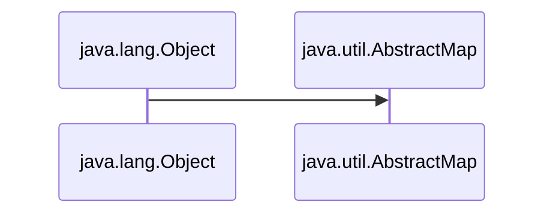
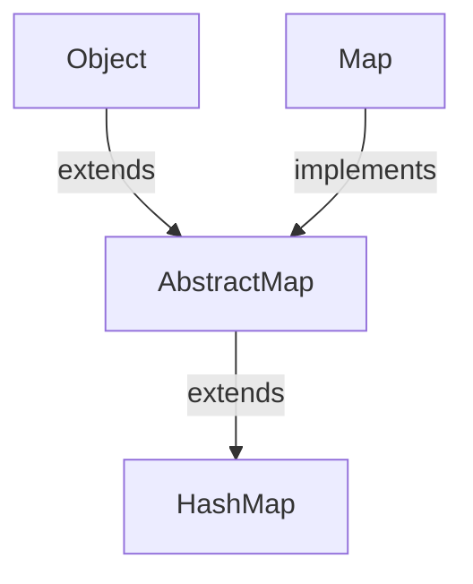

# JavaUtilMap
Here is all about Map of Java

<h1>1. AbstractMap </h1>
<ul>
<li> <h3> 1. Every class of Java is inherited  from <i> java.lang.Object </i>  </h3></li>
<li> <h3> 2. The <i> AbstractMap </i> class is the base class of the map classes in Java.</h3></li>




<li> <h3> 3. The <i>AbstractMap</i> class is a part of the Java Collection Framework.</h3></li>
<li> <h3> 4.  It directly implements the <i>Map</i> interface to provide a structure to it.</h3></li>
<li> <h3> 5.  <i>AbstractMap</i> is an abstract class, hence we cannot create <i>AbstractMap</i>'s Object but the concrete classes that inherit from <i>AbstractMap</i> can be used to create objects .</h3></li>

<br>

<table>
 <tr>
    <th>Interface</th>
    <th>Hash Table</th>
    <th>Resizable Array</th> 
   <th>Balanced Tree</th> 
   <th>Linked List</th> 
</tr> 
<tr>
  <td >Map</td>
  <td >HashMap</td> 
  <td ></td> 
  <td >TreeMap</td>
  <td ></td>
</tr>
<tr>
  <td >SortedMap</td>
  <td ></td> 
  <td ></td> 
  <td >TreeMap</td>
  <td ></td>
</tr>
<tr>
  <td >NavigableMap</td>
  <td ></td> 
  <td ></td> 
  <td >TreeMap</td>
  <td ></td>
</tr>
<tr>
  <td colspan="5">Map.Entry(Inner Class of Map)</td>
 
</tr>
</table>

<h3 align="center">

```Syntax

public abstract class AbstractMap<K,V> extends Object, implements Map<K,V>

```

</h3>

</ul>

<h1>2. Map Interface </h1>

<ul>
<li><h3>1. A <i> map</i> stores data in Key/Value pairs much like an array.</h3></li>
<li><h3>2. Every Key/Value pairs stored in indexes .</h3></li>
<li><h3>3. Every Key/Value pairs are stored as <i>Objects</i> in Java.</h3></li>
<li><h3>4. Typically , <i>keys</i> are Strings.</h3></li>
<li><h3>5. Given a Key and a Value, we can store the value in a <i>Map</i> object.</h3></li>
<li><h3>6. After the value is stored , we can retrieve it by using its Key.</h3></li>
<li><h3>7. Map is generic and is declared : </h3></li>

<h3 align="center">

```Syntax

interface Map<K,V>

```

</h3>


<h3> Where, <i>K</i> specifies the type of keys and <i>V</i> specifies the type of values. </h3>

<li><h3>8. Map do not implement the <i>Iterable</i> interface. Futhermore <i>Iterator</i> also cannot be obtained by a map.</h3></li>

<ul>

```Syntax

That is :

import java.util.Iterator;
import  java.lang.Iterable;

Iterable<Map<Key, Value>> itr = map; → Cannot be Obtained

Or

Iterator<Map<Key, Value>> iterator = map.iterator(); → Cannot be Obtained

```
</ul>

<table>
 <tr>
    <th>Interface</th>
    <th>Description</th>
    
   
</tr> 
<tr>
  <td >Map</td>
  <td >Maps unique keys to values.</td> 
</tr>
<tr>
  <td >Map.Entry</td>
  <td >Describes an element (a key/value) in a map. This is an inner class of Map.</td> 
  
</tr>
<tr>
  <td >NavigableMap</td>
  <td >It extends SortedMap to handle the retrieval of entries based on closest-match searches.</td> 
</tr>
<tr>
  <td >SortedMap</td>
  <td >It extends Map to keep the keys in ascending order.</td> 
</tr>
</table>
</ul>


<h1> 3. HashMap </h1>

<ul>

<h3>1. HashMap extends Abstract Map abstract class. </h3>
<h3>2. As Abstract Map implements Map interface and extends java.lang.Object class , HashMap inherits all of their functions. </h3>
<li> <h3> 3. And most imported thing : "The HashMap provides us an unsorted, unordered Map ".</h3></li>
<li> <h3> 4. HashMap has implementation based on a Hash table.</h3></li>
<li> <h3> 5. Duplicate keys are not allowed i.e. Keys are unique .</h3></li>
<li> <h3> 6. Whereas, Duplicate values can be present / allowed .</h3></li>



<h2> </h2>

<h2 align="Center">Constructors of HashMap </h2>

<ul>

<h3> <a href="https://github.com/AvinandanBose/JavaUtilMap/blob/main/map1.java"> 1.HashMap() </h3>

<h3> <a href="https://github.com/AvinandanBose/JavaUtilMap/blob/main/map2.java"> 2.HashMap(int initialCapacity) </h3>

<h3> <a href="https://github.com/AvinandanBose/JavaUtilMap/blob/main/map3.java"> 3.HashMap(int initialCapacity, float loadFactor) </h3>

<h3> <a href="https://github.com/AvinandanBose/JavaUtilMap/blob/main/map3.java"> 4.HashMap(Map<? extends K, ? extends V> m) </h3>

<table>
 <tr>
    <th>Constructor</th>
    <th>Does This</th>
    
   
</tr> 
<tr>
  <td >HashMap()</td>
  <td >It constructs a new empty map.</td> 
</tr>
<tr>
  <td >HashMap(int initialCapacity)</td>
  <td >It constructs a new empty map, with the given initial capacity.</td> 
  
</tr>
<tr>
  <td >HashMap(int initialCapacity, float loadFactor)</td>
  <td >It constructs a new empty map, with the given initial capacity and  the given load factor.</td> 
</tr>
<tr>
  <td >HashMap(Map<? extends K, ? extends V> m)</td>
  <td >It constructs a new  map, with the same mappings as the given map.</td> 
</tr>
</table>

</ul>

```Syntax

:ThresHold of HashMap, Capacity and LoadFactor:
--------------------------------------------------

ThresHold of HashMap : 
The threshold of a HashMap is approximately the product of current capacity and load factor

LoadFactor : 
The load factor is the measure that decides when to increase the capacity of the Map.

Capacity of HashMap: 
Capacity is the number of buckets in the HashMap. 

Default Capacity of HashMap: 16
That is empty HashMap created with capacity 16.

Default LoadFactor of HashMap: 0.75
That is empty HashMap created with Load Factor 0.75.

Default Threshold of HashMap: is 16 * 0.75 = 12.
That is empty HashMap created with threshold 12.

```


<h3> <i> Extras: </i> </h3>

```Syntax

Index: 
It is the integer value .
It is obtained after performing → 
Bitwise AND operation on the Value of Hash of the Key and Array Size Minus One.

i.e., :| Index = hashcode(key) & (ArraySize – 1) |:


Bucket: It is a LinkedList structure of nodes.


Node: It is the elementary unit of a HashMap. 
It contains the key-value pair and a link to the next node.

Next: Link to the next node.


```


<h2> </h2>

<h2 align="Center">Methods of HashMap </h2>

<ul>
<h3> <a href="https://github.com/AvinandanBose/JavaUtilMap/blob/main/mapmethods1.java"> 1.Clear </h3>

```Syntax

It removes all the mappings of this map.
The map will be empty after this call returns.

```

<h3> <a href="https://github.com/AvinandanBose/JavaUtilMap/blob/main/mapmethods2.java"> 2.Clone </h3>

```Syntax
Returns a shallow copy of the HashMap instance provided for cloning
but the keys and values themselves are not cloned.

```


<h3> <a href="https://github.com/AvinandanBose/JavaUtilMap/blob/main/mapmethods3.java"> 3.containsKey </h3>

```Syntax
Returns true if this map contains a mapping for the specified key.

```

<h3> <a href="https://github.com/AvinandanBose/JavaUtilMap/blob/main/mapmethods4.java"> 4.containsValue </h3>

```Syntax
Returns true if this map maps one or more keys to the specified value.

```

<h3> <a href="https://github.com/AvinandanBose/JavaUtilMap/blob/main/mapmethods5.java"> 5.forEach </h3>

```Syntax
Performs the given action for each entry in this map 
until all entries have been processed or the action throws an exception.

```


<h3> <a href="https://github.com/AvinandanBose/JavaUtilMap/blob/main/mapmethods6.java"> 6.get </h3>
  
```Syntax

Syntax: get(key: Key)

Returns the value to which the specified key is mapped, 
or null if this map contains no mapping for the key.

```

<h3> <a href="https://github.com/AvinandanBose/JavaUtilMap/blob/main/mapmethods7.java"> 7.getOrDefault</h3>

```Syntax

Syntax: getOrDefault(key: Key , defaultValue:Value)

Returns the value to which the specified key is mapped, 
or defaultValue if this map contains no mapping for the key.

i.e.,getOrDefault(key:"One" , defaultValue:1)
then it will return the value for the key : "One"
Or, it will return the value for the value : 1

Most priority given or first search is Key for Value .
If not found , then it searches for defaultValue for value.

That is if "One" is not found then it searches for 1.
```

<h3> <a href="https://github.com/AvinandanBose/JavaUtilMap/blob/main/mapmethods8.java"> 8.isEmpty</h3>

```Syntax

Returns true if this map contains no key-value mappings.
```

<h3> <a href="https://github.com/AvinandanBose/JavaUtilMap/blob/main/mapmethods9.java"> 9.KeySet</h3>

```Syntax

Returns a Set view of the keys contained in this map. 
The set is backed by the map, 
so changes to the map are reflected in the set, and vice-versa.

Noted:
As Set<K> keySet()→ Is a Function that returns Set,
Hence, it call all those functions that Set contains,
Such as:
→forEach
→toArray()
→remove()
→removeIf()
→retainAll()
→removeAll()
→Stream()
→ParallelStream()
→spliterator()
→iterator()
...etc.
```
</ul>

</ul>
